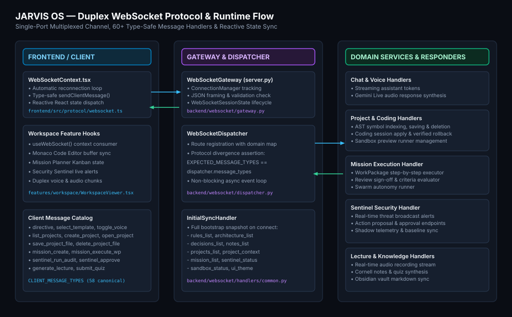
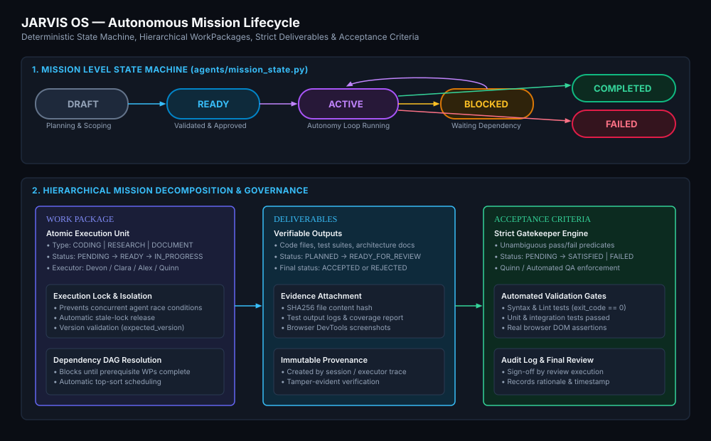
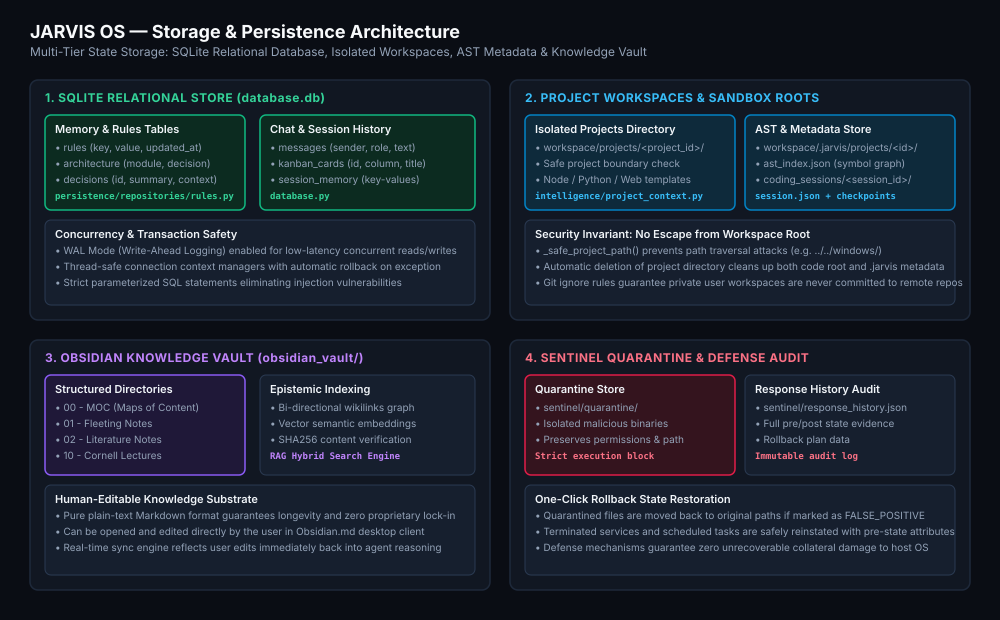

# JARVIS OS — Deep Technical Architecture

**JARVIS OS** is a deterministic, multi-agent cognitive operating system and autonomous orchestration platform designed for production engineering, secure local computing, and long-horizon goal execution.

---

## Architecture Navigation Index

1. [System Overview &amp; Design Philosophy](#1-system-overview--design-philosophy)
2. [Runtime Architecture &amp; Event Loop](#2-runtime-architecture--event-loop)
3. [Multi-Agent Swarm Architecture](#3-multi-agent-swarm-architecture)
4. [Autonomous Mission Lifecycle](#4-autonomous-mission-lifecycle)
5. [Coding Agent 2.0 Pipeline](#5-coding-agent-20-pipeline)
6. [Model Harness &amp; Profile Routing](#6-model-harness--profile-routing)
7. [Persistence &amp; Multi-Tier Storage](#7-persistence--multi-tier-storage)
8. [Duplex WebSocket Message Protocol](#8-duplex-websocket-message-protocol)
9. [Knowledge Vault, Cornell Lectures &amp; RAG](#9-knowledge-vault-cornell-lectures--rag)
10. [Security Sentinel EDR &amp; Host Watchdog](#10-security-sentinel-edr--host-watchdog)
11. [Economic Layer &amp; 4-Tier Evidence Taxonomy](#11-economic-layer--4-tier-evidence-taxonomy)
12. [Browser QA &amp; Computer Use Engine](#12-browser-qa--computer-use-engine)
13. [Observability, Telemetry &amp; Flight Recorder](#13-observability-telemetry--flight-recorder)
14. [Deterministic Failure Recovery Loops](#14-deterministic-failure-recovery-loops)
15. [Trust Boundaries &amp; Sandbox Enclaves](#15-trust-boundaries--sandbox-enclaves)
16. [Comprehensive Data Flows](#16-comprehensive-data-flows)
17. [Core Architectural Invariants](#17-core-architectural-invariants)

---

## 1. System Overview &amp; Design Philosophy

```
+-----------------------------------------------------------------------------+
|                                  JARVIS OS                                  |
|        Deterministic * Explainable * Offline-First * Defensive Security     |
+-----------------------------------------------------------------------------+
```

JARVIS OS bridges human natural language direction and deterministic desktop software execution. Unlike fragile conversational wrappers that rely on unbounded model generation, JARVIS OS treats language models as **stochastic reasoning engines operating inside strict mechanical harnesses**.

### Key Architectural Tenets
1. **Deterministic Contracts**: All communication between agents, models, persistent stores, and user interfaces is bounded by versioned schemas (`schemas/`).
2. **Offline-First &amp; Hybrid Economics**: Local execution with Ollama (`qwen3.5:9b`) guarantees 100% data privacy and zero cost. Free cloud reasoning tiers (OpenRouter) are utilized for complex planning.
3. **Defensive Host Protection**: Integrated Security Sentinel monitors host-level mutations with mandatory human approval gates for critical actions.
4. **AST-Level Precision**: Code modifications are executed via AST symbol graph manipulation rather than blind whole-file rewrites.


---

## 2. Runtime Architecture &amp; Event Loop

The JARVIS OS backend is powered by Python 3.11+ using an asynchronous event-driven architecture (`backend/application_lifecycle.py` and `server.py`):
- **FastAPI / Uvicorn Core**: Hosts HTTP health endpoints and single-port WebSocket endpoints.
- **WebSocket Gateway (`backend/websocket/gateway.py`)**: Manages client connection lifecycles, connection tracking, and broadcast channels.
- **WebSocket Dispatcher (`backend/websocket/dispatcher.py`)**: Central router mapping inbound message opcodes to async domain handlers with zero protocol drift assertion.
- **Electron Shell (`main.js`)**: Desktop window manager communicating over loopback with automatic process management and graceful shutdown (`taskkill /F /T` on Windows).



---

## 3. Multi-Agent Swarm Architecture

JARVIS OS deploys a specialized multi-agent swarm where each agent operates with dedicated domain responsibilities:


| Agent | Core Specialization | Primary Responsibilities | Engineered Skills |
|---|---|---|---|
| **Clara** | Executive &amp; Coordinator | Intent extraction, mission scoping, user communication, synthesis | `planning-and-task-breakdown`, `shipping-and-launch` |
| **Alex** | Systems Architect | System design, monorepo graphs, API contracts, ADR authoring | `api-and-interface-design`, `spec-driven-development` |
| **Devon** | Coding Engineer | AST symbol replacement, atomic patching, build &amp; self-repair | `test-driven-development`, `code-review-and-quality`, `code-simplification` |
| **Quinn** | QA &amp; Security Sentinel | DevTools browser QA, EDR watchdog audits, adversarial stress testing | `browser-testing-with-devtools`, `security-and-hardening` |

### Inter-Agent Debate &amp; Consensus Protocol
When evaluating complex architecture designs or high-impact mission plans, agents initiate structured multi-agent debates (`agents/swarm.py`). Dialogue turns are recorded directly into the SQLite database and streamed live to the Workspace HUD.

---

## 4. Autonomous Mission Lifecycle

Missions in JARVIS OS follow an explicit, deterministic state machine (`agents/mission_state.py`):



### Hierarchical Mission Decomposition
1. **Mission**: High-level goal (`DRAFT` &rarr; `READY` &rarr; `ACTIVE` &rarr; `COMPLETED` / `FAILED`).
2. **WorkPackage**: Atomic task unit with executor assignment and dependency DAG resolution.
3. **Deliverable**: Verifiable output (code files, test suites, documents) bound to cryptographic SHA256 hashes.
4. **Acceptance Criteria**: Pass/fail predicates evaluated automatically by test suites or Quinn.

---

## 5. Coding Agent 2.0 Pipeline

The Coding Agent pipeline (`intelligence/`) replaces fragile fuzzy patching with deterministic Abstract Syntax Tree manipulation:


### 9-Stage Pipeline Execution
1. **Specification**: Spec-driven requirements contract (`spec-driven-development`).
2. **Artifact Inference**: Identifies target files, entry points, and schema boundaries (`artifact_inference.py`).
3. **Repository Graph**: Analyzes monorepo structures, `tsconfig.json` path mappings, and dependencies (`repository_graph.py`).
4. **AST Symbol Graph**: Extracts function, class, and interface definitions with byte ranges (`project_context.py`).
5. **Cross-File Validator**: Validates type signatures and exports across module boundaries (`cross_file_validator.py`).
6. **Coding Session Planner**: Generates multi-file unified diffs with pre-state checkpoint backups (`coding_session.py`).
7. **Atomic Patch Engine**: Swaps exact AST node snippets without altering surrounding lines (`agents/patch_engine.py`).
8. **Build &amp; Runtime Verification**: Validates compilation (`py_compile`, `tsc`) and starts sandboxed preview servers.
9. **Real Browser QA &amp; Self-Repair Loop**: Inspects browser DOM/DevTools and triggers `autonomous_repair_loop.py` on failures.

---

## 6. Model Harness &amp; Profile Routing

The Model Harness (`backend/model_harness/`) decouples agents from specific AI vendors:


### Profile Routing Matrix
- **`default`**: Balanced general tasks (Ollama `qwen3.5:9b` / OpenRouter).
- **`coding`**: High-precision code generation with strict syntax constraints.
- **`fast`**: Sub-second low-latency conversational responses.
- **`reasoning`**: Deep multi-step mission planning and architectural synthesis.

### 7-Stage Output Validation Loop
Every model completion is checked through:
1. `PARSING`: Balanced syntax and JSON extraction.
2. `SCHEMA`: Strict compliance with target JSON schema.
3. `ENUMS`: Allowed vocabulary check.
4. `REFERENCES`: Verified existence of mentioned files and symbols.
5. `PRECONDITIONS`: State machine readiness check.
6. `COMPATIBILITY`: Signature contract verification.
7. `RECOVERY`: Deterministic mechanical repair before fallback retries.

---

## 7. Persistence &amp; Multi-Tier Storage

JARVIS OS uses a multi-tier persistence model combining relational speed, filesystem transparency, and human readability:



1. **SQLite (`database.db`)**: WAL-enabled relational storage for rules, decisions, messages, and Kanban cards.
2. **Project Metadata (`workspace/.jarvis/`)**: AST symbol indexes (`ast_index.json`) and coding session checkpoints.
3. **Obsidian Knowledge Vault (`obsidian_vault/`)**: Human-readable Markdown notes and study guides.
4. **Sentinel Quarantine (`sentinel/quarantine/`)**: Isolated suspicious binaries with pre-state attributes.

---

## 8. Duplex WebSocket Message Protocol

All client-server interaction runs over a single, multiplexed WebSocket channel:
- **Client Messages**: 58 canonical opcodes defined in [`websocket_schema.py`](./websocket_schema.py) and typed in [`frontend/src/protocol/websocket.ts`](./frontend/src/protocol/websocket.ts).
- **Server Messages**: 40+ typed responses covering streaming tokens, audio levels, AST updates, and Sentinel alerts.
- **Static Schema Alignment**: [`tests/test_websocket_dispatcher_contract.py`](./tests/test_websocket_dispatcher_contract.py) asserts that the dispatcher never diverges from canonical protocol schemas.

---

## 9. Knowledge Vault, Cornell Lectures &amp; RAG


- **Obsidian Knowledge Vault**: Over 100 structured markdown files categorized into MOCs, fleeting notes, and literature reviews.
- **Cornell Lecture Recorder &amp; Synthesizer (`services/`)**: Captures live audio, transcribes with Whisper, generates formatted Cornell notes with cues and summaries, and synthesizes interactive quizzes.
- **Hybrid Vector &amp; Epistemic RAG**: Combines vector embeddings with graph backlinks for high-precision retrieval.

---

## 10. Security Sentinel EDR &amp; Host Watchdog


- **Host Telemetry Collectors**: Continuous monitoring of Windows process creation, listening ports, scheduled tasks, and filesystem activity.
- **Baseline Drift Detection**: Measures drift from known-good system snapshots.
- **Temporal Correlation Engine**: Aggregates anomalous events into incidents within 60-second correlation windows.
- **Mandatory Human Approval**: High-risk mutations require operator confirmation.
- **Reversible Rollback**: Instant restoration of quarantined files and disabled tasks.

---

## 11. Economic Layer &amp; 4-Tier Evidence Taxonomy

JARVIS OS strictly classifies economic tasks into 4 verifiable tiers to prevent ungrounded claims:


1. **Tier 1: `SYNTHETIC_BENCHMARK`**: Local mock tests and synthetic coding problem suites.
2. **Tier 2: `EXTERNAL_OBSERVED`**: Real-world read-only web scraping and arXiv paper extraction.
3. **Tier 3: `EXTERNAL_VERIFIED`**: Authenticated API calls, remote Git operations, and live browser testing.
4. **Tier 4: `FINANCIAL_TRANSACTION_VERIFIED`**: Verifiable financial receipts and settlement records.

---

## 12. Browser QA &amp; Computer Use Engine

- **Chrome DevTools Protocol Integration**: Real browser automation for E2E testing (`evidence/browser_validation/`).
- **DOM &amp; Visual Evidence**: Captures full-page DOM trees, network error logs, and multi-step screenshots (`before`, `action`, `after`).
- **Desktop Control**: Voice-activated Windows application launching (`abrir VS Code`, `abrir Excel`, `abrir Chrome`).

---

## 13. Observability, Telemetry &amp; Flight Recorder

- **Flight Recorder (`diagnostics/`)**: Records structured event timelines for every mission.
- **Model Telemetry (`TelemetryRecord`)**: Measures request latency, prompt/completion tokens, and financial cost.
- **Progress Monitoring**: Halts execution if semantic progress is stalled (`NO_PROGRESS` / `REPEATED_FAILURES`).

---

## 14. Deterministic Failure Recovery Loops

1. **AST Repair v2**: Localized syntax fixes upon compilation failure.
2. **Failure Memory Bank**: Fingerprints broken patches to prevent repeating erroneous repairs.
3. **Automatic Checkpoint Rollback**: Immediate state restoration if a patch fails post-modification tests.

---

## 15. Trust Boundaries &amp; Sandbox Enclaves

- **Workspace Jailing**: Operations outside `workspace/projects/<project_id>/` are rejected.
- **Quarantine Boundary**: Suspect files are stripped of execution permissions and moved to `sentinel/quarantine/`.
- **Zero Secret Leakage**: All keys are strictly loaded via `.env` and excluded from Git.

---

## 16. Comprehensive Data Flows

```
[User / CEO] 
     │ (Natural Language Prompt / Voice)
     ▼
[Clara: Executive] ──> [Alex: Architecture] ──> [Devon: Coding] ──> [Quinn: QA]
     │                      │                        │                  │
     ▼                      ▼                        ▼                  ▼
[Mission Spec]      [Repo & AST Graph]      [Atomic Patch]      [Browser QA & Sentinel]
     │                      │                        │                  │
     └──────────────────────┴────────────────────────┴──────────────────┘
                                    │
                                    ▼
                     [Model Harness Validation Loop]
                                    │
                                    ▼
                     [SQLite / Workspace / Vault]
```

---

## 17. Core Architectural Invariants

1. **No Untyped WebSocket Messages**: Every frame must match a registered opcode.
2. **No Unchecked File Overwrites**: All code patches must be preceded by an automated checkpoint.
3. **No Unapproved Sentinel Mutations**: Containment actions require human operator sign-off.
4. **Strict Economic Transparency**: Synthetic benchmarks are never labeled as financial revenue.
5. **Full Test Suite Integrity**: Zero failing tests allowed across all 38+ pytest suites.
