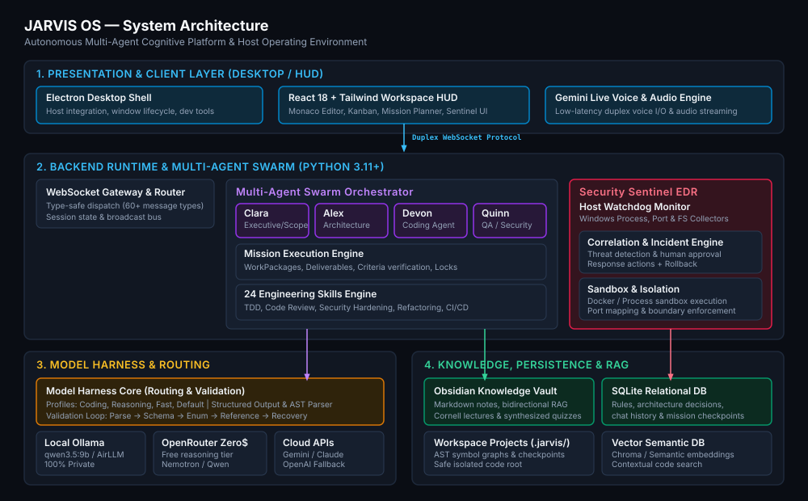
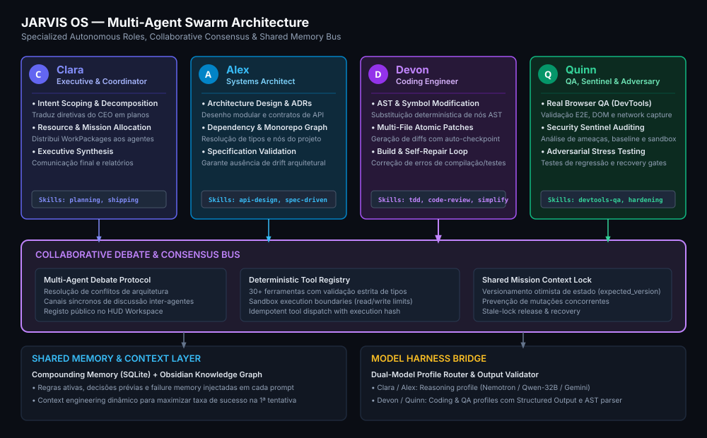
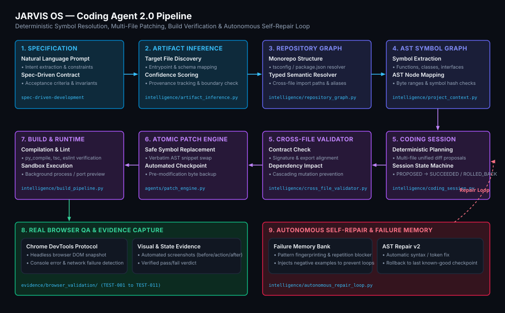
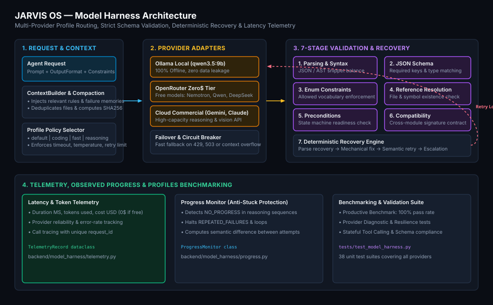
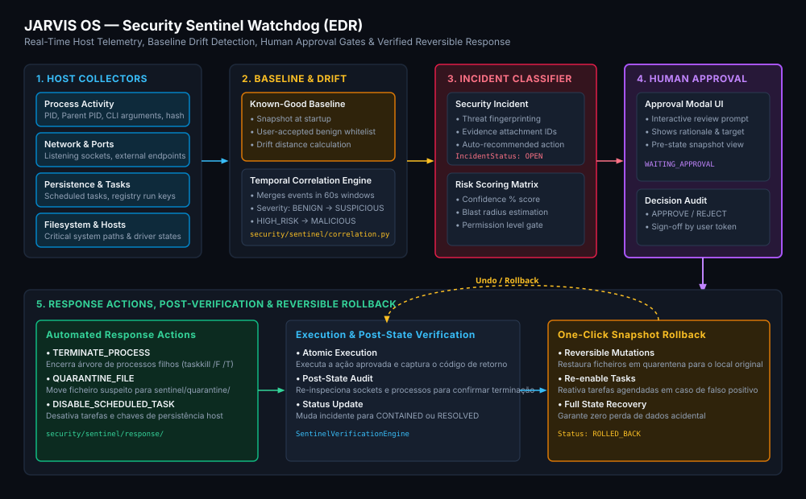
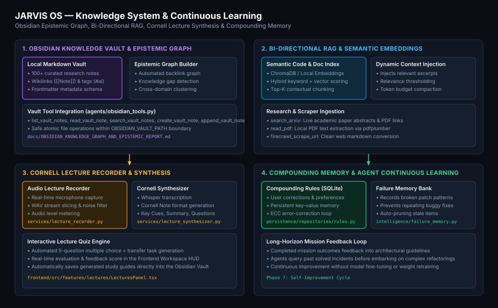
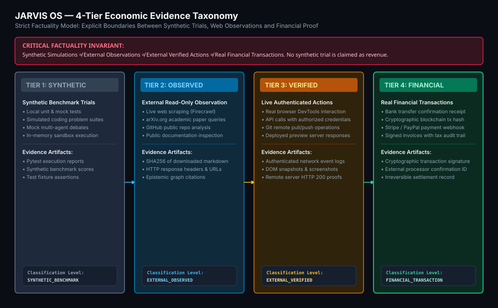

# 🤖 JARVIS OS — Autonomous Multi-Agent Cognitive Platform

<p align="center">
  
  
  
  
  
  
  
</p>

> **JARVIS OS** is a deterministic, multi-agent cognitive operating system and autonomous orchestration platform designed for production engineering, secure local computing, and long-horizon goal execution.

---

## 🧭 Navigation Table

| Area | Documentation Link | Description |
|---|---|---|
| 🏛️ **Architecture** | [`ARCHITECTURE.md`](./ARCHITECTURE.md) | Deep technical architecture specification &amp; invariants |
| 📊 **Diagrams** | [`docs/diagrams/`](./docs/diagrams/) | 10 high-fidelity standalone SVG architecture diagrams |
| 📐 **JSON Schemas** | [`schemas/README.md`](./schemas/README.md) | Canonical Draft-07 schemas for all data contracts |
| 🛡️ **Security Policy** | [`SECURITY.md`](./SECURITY.md) | Sentinel watchdog, vulnerability reporting &amp; sandbox boundaries |
| 🗺️ **Project Map** | [`docs/PROJECT_MAP.md`](./docs/PROJECT_MAP.md) | Physical directory, module, and dependency index |
| ⚖️ **ADRs** | [`docs/decisions/`](./docs/decisions/) | Architecture Decision Records (ADR-001 to ADR-006) |
| 📈 **Benchmarks** | [Benchmark Reports](#-benchmarks--validation-reports) | 10 empirical validation &amp; capability test reports |
| 🤝 **Contributing** | [`CONTRIBUTING.md`](./CONTRIBUTING.md) | Contribution standards, code style &amp; PR requirements |
| 📜 **Changelog** | [`CHANGELOG.md`](./CHANGELOG.md) | Factual historical release and feature log |

---

## 🌟 Overview

JARVIS OS bridges human natural language intent and deterministic desktop software execution. Rather than relying on unconstrained language generation, JARVIS OS treats AI models as **stochastic reasoning components operating inside strict mechanical harnesses**, bounded by typed schemas, AST symbol parsers, real browser QA, and host endpoint security monitoring.

---

## 🏛️ System Architecture



---

## ⚡ Core Capabilities

1. **Autonomous Missions**: Hierarchical mission decomposition into atomic WorkPackages with dependency DAG resolution and deterministic checkpoints.
2. **Multi-Agent Swarm**: Four specialized autonomous agents (**Clara**, **Alex**, **Devon**, **Quinn**) collaborating via structured debate and consensus channels.
3. **Coding Agent 2.0 Engine**: AST symbol extraction, cross-file typed semantic resolution, multi-file atomic patches, and autonomous self-repair loops.
4. **Hybrid Model Harness**: Multi-provider routing with local offline execution (Ollama `qwen3.5:9b`), zero-cost cloud reasoning (OpenRouter), and commercial cloud failover with 7-stage schema validation.
5. **Continuous Compounding Memory**: SQLite-backed rules engine with ECC self-correction learning from user feedback on every turn.
6. **Bi-Directional Knowledge Vault**: Over 100 structured Markdown notes in an Obsidian vault with vector semantic search and backlink graphs.
7. **Cornell Lecture Synthesis**: Voice-recorded lectures transcribed with Whisper, formatted as Cornell notes with cues and summaries, and synthesized into interactive quizzes.
8. **Real Browser QA &amp; Computer Use**: Chrome DevTools Protocol automation capturing DOM trees, network error logs, and multi-step visual screenshots.
9. **Security Sentinel (EDR Watchdog)**: Real-time Windows host telemetry monitor (processes, ports, persistence, FS) with human approval gates and one-click rollback.
10. **4-Tier Economic Taxonomy**: Strict evidence categorization separating synthetic benchmarks from external observations and real financial transactions.

---

## 👥 Multi-Agent Swarm Architecture

JARVIS OS organizes autonomous tasks across four specialized agent personas:



- **Clara (Executive &amp; Coordinator)**: Decomposes CEO directives into scoped missions, schedules work packages, and synthesizes executive reports.
- **Alex (Systems Architect)**: Authors Architecture Decision Records (ADRs), maps dependency graphs, and validates API contracts.
- **Devon (Coding Engineer)**: Performs AST symbol replacements, applies multi-file atomic patches, and operates the build/repair loop.
- **Quinn (QA, Sentinel &amp; Adversary)**: Runs headless browser DevTools tests, executes Security Sentinel audits, and enforces quality gates.

---

## 💻 Coding Agent 2.0 Pipeline

The Coding Agent pipeline replaces whole-file rewrites with deterministic AST symbol manipulation:

```
Prompt ──> Specification ──> Artifact Inference ──> Repository Graph
  ──> AST Symbol Graph ──> Coding Session Plan ──> Atomic Patch Engine
  ──> Build Pipeline (tsc/py_compile) ──> Browser DevTools QA ──> Self-Repair Loop
```



- **AST Symbol Replacement**: Changes only target function/class nodes, preventing collateral syntax breakage in surrounding code.
- **Cross-File Type Resolution**: Resolves TypeScript `@/*` path aliases and Python relative imports across monorepos.
- **Automated Checkpoints &amp; Rollback**: Captures pre-modification byte snapshots with instant restoration on test failure.

---

## 🔄 Model Harness &amp; Routing

The Model Harness (`backend/model_harness/`) provides multi-provider abstraction with deterministic output guarantees:

```
Request ──> Context Builder ──> Profile Router ──> Provider Execution
  ──> 7-Stage Validation Loop ──> Deterministic Recovery ──> Telemetry Recording
```



- **Profiles**: `default`, `coding`, `fast`, `reasoning`.
- **Supported Providers**: Ollama (local `qwen3.5:9b`), OpenRouter (free tier `nemotron`, `qwen`), Google Gemini, Anthropic Claude, OpenAI.
- **7-Stage Validation**: `parsing` &rarr; `schema` &rarr; `enums` &rarr; `references` &rarr; `preconditions` &rarr; `compatibility` &rarr; `acceptance_criteria`.

---

## 🛡️ Security Sentinel Watchdog (EDR)

Security Sentinel (`security/sentinel/`) continuously guards the host operating system against anomalous agent behaviors:

```
Windows Host ──> Process/Port/FS Collectors ──> Baseline Drift Analysis
  ──> Temporal Correlation ──> Incident Scoring ──> Human Approval Gate
  ──> Containment Action (Kill/Quarantine) ──> Post-State Verification ──> One-Click Rollback
```



- **Host Monitoring**: Windows process spawn trees, TCP/UDP listening ports, Task Scheduler persistence, and filesystem writes.
- **Human Approval Mandatory**: High-risk mutations (`TERMINATE_PROCESS`, `QUARANTINE_FILE`, `DISABLE_SCHEDULED_TASK`) require explicit user confirmation.
- **One-Click Reversible Rollback**: Quarantined files and disabled tasks can be restored with a single click.

---

## 📚 Knowledge Vault &amp; Continuous Learning

```
Obsidian Markdown Vault ──> Bi-Directional Epistemic Graph ──> Vector Embeddings / RAG
  ──> Cornell Lecture Audio Recorder ──> Whisper Synthesizer ──> Interactive Quiz Engine
  ──> Compounding Memory (SQLite) ──> Future Mission Context Injection
```



- **Obsidian Vault (`obsidian_vault/`)**: Plain-text markdown files organized into MOCs, literature notes, and study guides.
- **Cornell Lectures (`services/`)**: Live audio capture converted into structured Cornell notes and self-grading quizzes.
- **Compounding Rules**: Rules learned from human corrections are persisted in SQLite and injected into subsequent prompts.

---

## ⚖️ 4-Tier Economic Evidence Taxonomy

To ensure complete scientific integrity and prevent exaggerated claims, JARVIS OS classifies all economic activities into 4 explicit tiers:



| Tier | Category | Operational Definition | Verification Proof |
|---|---|---|---|
| **Tier 1** | `SYNTHETIC_BENCHMARK` | Simulated coding problem suites and unit trials | Automated test assertion logs &amp; exit codes |
| **Tier 2** | `EXTERNAL_OBSERVED` | Real-world read-only web/paper data extraction | SHA256 content hashes &amp; HTTP headers |
| **Tier 3** | `EXTERNAL_VERIFIED` | Authenticated API calls and live browser automation | Network traces &amp; DevTools DOM snapshots |
| **Tier 4** | `FINANCIAL_TRANSACTION` | Actual monetary exchange or bank transfer | Cryptographic signatures &amp; settlement receipts |

> [!IMPORTANT]
> **No synthetic simulation or test benchmark is ever represented as real financial revenue.**

---

## 📁 Repository Structure

```
ai-company-orchestrator/
├── agents/                  # Multi-agent swarm (Clara, Alex, Devon, Quinn), mission executors, tools
├── backend/                 # Core server runtime, Model Harness, WebSocket gateway, lifecycle
├── config/                  # Global system configuration and runtime parameters
├── diagnostics/             # Environment diagnostic tools and system telemetry scripts
├── docs/                    # Architectural specifications, benchmark reports, diagrams, and ADRs
│   ├── decisions/           # Architecture Decision Records (ADR-001 to ADR-006)
│   └── diagrams/            # Standalone vector SVG architecture diagrams (01 to 10)
├── evidence/                # Verified test run evidence (screenshots, DOM dumps, event logs)
├── frontend/                # React 18 + Tailwind + Monaco Editor desktop workspace HUD
├── intelligence/            # Coding Agent 2.0 (AST repair, repo graph, semantic resolver, build loop)
├── obsidian_vault/          # Plain-text Markdown Knowledge Vault and Cornell study guides
├── persistence/             # SQLite repositories for rules, decisions, projects and messages
├── schemas/                 # Canonical JSON Schemas (Draft-07) for core data contracts
├── security/                # Security Sentinel watchdog, EDR host monitors, safety classifier
├── sentinel/                # Sentinel quarantine store and response history audit log
├── services/                # Specialized background services (Lecture recorder, synthesizer, AirLLM)
├── tests/                   # 38+ automated pytest test suites (953 passed tests)
└── workspace/               # Isolated project code sandboxes and AST metadata (.jarvis/)
```

---

## 🚀 Getting Started

### 1. Prerequisites
- **OS**: Windows 10/11, macOS, or Linux (Windows recommended for full Sentinel EDR collectors)
- **Python**: 3.11 or higher
- **Node.js**: v20+ and `npm`
- **Ollama** *(optional)*: For 100% offline, private model execution (`qwen3.5:9b`)

### 2. Backend Setup
```powershell
# Create and activate Python virtual environment
python -m venv venv
.\venv\Scripts\python.exe -m pip install --upgrade pip
.\venv\Scripts\python.exe -m pip install -r requirements.txt
.\venv\Scripts\python.exe -m playwright install chromium

# Configure environment variables
Copy-Item .env.example .env
```

### 3. Frontend &amp; Desktop HUD Setup
```powershell
npm install
npm install --prefix frontend
```

### 4. Running JARVIS OS
```powershell
# Launch Desktop Application (Electron + React HUD + Backend Server)
npm start

# Or launch development mode (Vite Dev Server + Server)
npm run dev

# Or run standalone Python backend server
.\venv\Scripts\python.exe server.py
```

---

## 🧪 Testing &amp; Verification

JARVIS OS maintains a comprehensive automated testing suite:

```powershell
# Run the complete test suite (953 tests)
.\venv\Scripts\python.exe -m pytest tests/ -q

# Run documentation & schema integrity tests
.\venv\Scripts\python.exe -m pytest tests/test_documentation_integrity.py -q

# Run Security Sentinel EDR test suites
.\venv\Scripts\python.exe -m pytest tests/test_sentinel.py tests/test_sentinel_response_actions.py -q

# Run Coding Agent 2.0 benchmarks
.\venv\Scripts\python.exe -m pytest tests/test_coding_agent_2_benchmark.py tests/test_repository_graph.py -q

# Validate frontend TypeScript zero-error build
npm run build --prefix frontend
```

---

## 📊 Benchmarks &amp; Validation Reports

Detailed empirical reports documenting capabilities and validation trials:

- [`JARVIS_CODING_AGENT_2_REPORT.md`](./docs/JARVIS_CODING_AGENT_2_REPORT.md) — Coding Agent 2.0 Benchmark Suite.
- [`JARVIS_CODING_AGENT_2_2_REAL_REPOSITORY_REPORT.md`](./docs/JARVIS_CODING_AGENT_2_2_REAL_REPOSITORY_REPORT.md) — Real Repository Trial &amp; Refactoring.
- [`JARVIS_CODING_AGENT_2_3_LONG_HORIZON_REPORT.md`](./docs/JARVIS_CODING_AGENT_2_3_LONG_HORIZON_REPORT.md) — Long-Horizon Multi-File Coding Trials.
- [`JARVIS_CODING_AGENT_2_4_TYPED_SEMANTICS_REPORT.md`](./docs/JARVIS_CODING_AGENT_2_4_TYPED_SEMANTICS_REPORT.md) — TypeScript Typed Semantic Resolution.
- [`SENTINEL_S5_DETECTION_QUALITY_REPORT.md`](./docs/SENTINEL_S5_DETECTION_QUALITY_REPORT.md) — Security Sentinel Detection Benchmark.
- [`SENTINEL_S6_SHADOW_MODE_REPORT.md`](./docs/SENTINEL_S6_SHADOW_MODE_REPORT.md) — Sentinel Zero-Interference Shadow Mode.
- [`OBSIDIAN_KNOWLEDGE_GRAPH_AND_EPISTEMIC_REPORT.md`](./docs/OBSIDIAN_KNOWLEDGE_GRAPH_AND_EPISTEMIC_REPORT.md) — Epistemic Graph &amp; Knowledge Engineering.
- [`JARVIS_REALTIME_BROWSER_VALIDATION_REPORT.md`](./docs/JARVIS_REALTIME_BROWSER_VALIDATION_REPORT.md) — Real-Time Browser DevTools Autonomous QA.
- [`JARVIS_PHASE7_SELF_IMPROVEMENT_REPORT.md`](./docs/JARVIS_PHASE7_SELF_IMPROVEMENT_REPORT.md) — Self-Improvement &amp; Failure Memory Loop.
- [`JARVIS_PHASE10_REAL_WORLD_VALUE_REPORT.md`](./docs/JARVIS_PHASE10_REAL_WORLD_VALUE_REPORT.md) — Controlled Real-World Economic Value Validation.

---

## 🔒 Security

For vulnerability disclosures, Sentinel EDR architecture details, and sandbox boundaries, please consult [`SECURITY.md`](./SECURITY.md).

---

## 📜 License

Developed in the context of research on **Autonomous Multi-Agent Cognitive Systems &amp; Software Engineering Automation**. Distributed under the **MIT License**. Engineering skills based on specifications by [Addy Osmani (`agent-skills`)](https://github.com/addyosmani/agent-skills).
