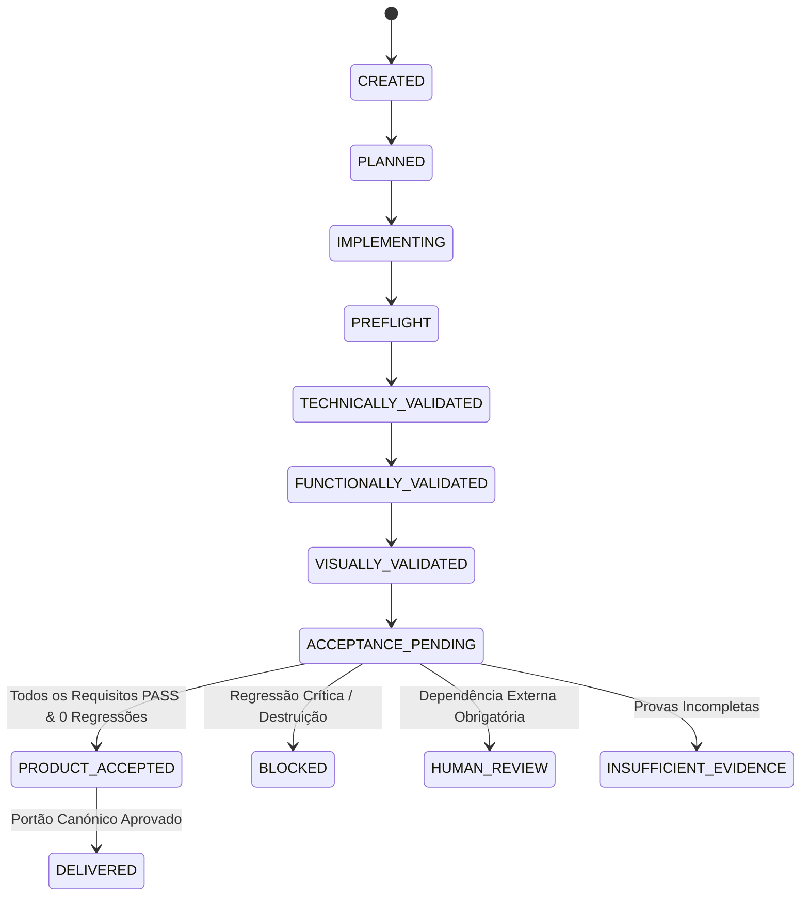

# RELATÓRIO DE AUDITORIA E GOVERNANÇA DE ENTREGA DE PRODUTO DO JARVIS

**Data:** 07 de Outubro de 2026
**Status do Portão Canónico:** `AUTONOMOUS_PRODUCT_DELIVERY_READY = TRUE`
**Commit de Referência:** `feat(governance): enforce product-level acceptance before autonomous delivery`

---

## 1. RESUMO EXECUTIVO

Esta auditoria e intervenção arquitetural foi conduzida para solucionar a razão estrutural pela qual o JARVIS conseguia produzir alterações de código que:
1. Passavam nos testes técnicos internos (`node --check`, `py_compile`);
2. Eram marcadas nos ecrãs como `"Validada"` (Badge verde esmeralda);
3. Mas entregavam ao utilizador um produto final **funcionalmente incompleto, visualmente degradado ou semanticamente divergente do requisito**.

O caso empírico de referência observado no projeto `workspace/projects/dina` demonstrou que uma alteração assistida:
- Substituiu destrutivamente o ficheiro `index.html`;
- Eliminou a casca HTML fundamental (`<!DOCTYPE html>`, `<html>`, `<head>`, `<body>`);
- Deixou de carregar `styles.css` e `client.js`;
- Deixou botões interativos sem comportamento (`dead buttons`);
- Degradou visualmente a aplicação para controlos browser brutos e sem layout;
- **Contudo, foi rotulada como "Validada"** unicamente porque `node --check` passou sem erros.

A causa raiz foi eliminada através da substituição do pipeline superficial baseado em validação sintática isolada (`CODE_VALIDATION`) por um pipeline holístico de **Aceitação de Produto** (`PRODUCT_ACCEPTANCE`).

---

## 2. ARQUITETURA DE VALIDAÇÃO ANTERIOR VS NOVA ARQUITETURA

```mermaid
graph TD
    subgraph Arquitetura Anterior (Vulnerável)
        A1[User Request] --> B1[Code Generation]
        B1 --> C1[Write Files]
        C1 --> D1[node --check / py_compile]
        D1 -->|Exit Code 0| E1[Status: SUCCEEDED]
        E1 --> F1[UI: 'Validada' Verde]
        D1 -.->|Zero validação HTML/CSS/Assets| G1[Produto Quebrado Entregue]
    end

    subgraph Nova Arquitetura: Product Delivery Gate
        A2[User Request] --> B2[Atomic RequirementTraceability]
        B2 --> C2[Preservation Baseline Snapshot]
        C2 --> D2[Destructive Change Detector]
        D2 --> E2[Technical Validation: Syntax & Build]
        E2 --> F2[HTML Document Structure & Shell Validator]
        F2 --> G2[Asset & Module Integrity Validator]
        G2 --> H2[Visual & Layout Integrity Validator]
        H2 --> I2[Interaction & Button Wiring Validator]
        I2 --> J2[External Dependency Governance]
        J2 --> K2[Requirement Reconciliation Gate]
        K2 -->|Todos PASS & 0 Regressões| L2[PRODUCT_ACCEPTED / Autonomously Ready]
        K2 -->|Regressão / Asset em falta| M2[BLOCKED_INTEGRITY_REGRESSION]
        K2 -->|Dependência Externa Obrigatória| N2[AWAITING_HUMAN_APPROVAL]
    end
```

---

## 3. IDENTIFIED ROOT CAUSE (CAUSA RAIZ IDENTIFICADA)

A auditoria exaustiva em `intelligence/coding_session.py`, `agents/orchestrator/project_builder.py` e `frontend/src/features/workspace/WorkspaceViewer.tsx` provou:

1. **Ausência de validadores para artefactos Web:** Em `_select_validations`, ficheiros `.html` e `.css` tinham `command = None`. Apenas ficheiros `.js` e `.py` recebiam comandos (`node --check` e `py_compile`).
2. **Conflito Semântico de 'Done':** O sistema assumia `Exit Code 0 de node --check` $\Rightarrow$ `SUCCEEDED`. Na interface `WorkspaceViewer.tsx`:
   ```typescript
   if (normalized === 'SUCCEEDED') return { label: 'Validada', tone: 'bg-emerald-300/10 text-emerald-200' };
   ```
   Isso induzia o utilizador em erro, fazendo-o acreditar que o **produto** estava validado quando apenas um verificador léxico do Node tinha sido executado.
3. **Inexistência de Deteção de Destruição e Regressão:** Quando o modelo propunha reescrever `index.html`, o sistema não comparava o novo código com os scripts, estilos e botões previamente ativos.
4. **Falso Positivo com Evidência Ausente:** A ausência de testes em HTML era tratada implicitamente como aprovação.

---

## 4. SEPARAÇÃO ESTRITA DOS NÍVEIS DE ACEITAÇÃO

Formalizado no modelo `security/delivery_governance/models.py` (`AcceptanceLevel`):

| Nível | Significado Formal | Não Implica |
| :--- | :--- | :--- |
| `SYNTAX_VALID` | Código fonte respeita as regras gramaticais da linguagem | Build bem-sucedido ou UI funcional |
| `TYPE_VALID` | Verificação estática de tipos passou | Runtime sem exceções |
| `BUILD_VALID` | Bundler/compilador gerou artefactos | Requisitos satisfeitos |
| `RUNTIME_VALID` | Processo arranca e responde a health checks | Interface utilizável ou completa |
| `FUNCTIONALLY_VALID` | Controlos e rotas respondem como esperado | Integridade estética ou requisitos satisfeitos |
| `VISUALLY_VALID` | Estilos, layout, fontes e viewport estão ativos | Ausência de erros funcionais |
| `PRODUCT_ACCEPTED` | **Todos os requisitos rastreáveis validados + 0 regressões + integridade preservada** | Aceitação humana final |
| `USER_ACCEPTED` | Decisão explícita do utilizador | N/A |

---

## 5. MÓDULOS DE GOVERNANÇA IMPLEMENTADOS

### 5.1. `PreservationAnalyzer` & `DestructiveChangeDetector`
- **Ficheiro:** `security/delivery_governance/integrity_detector.py`
- Captura snapshot pré-alteração de `html_files`, `scripts`, `stylesheets`, `endpoints`, `event_listeners`, `buttons`, `forms`.
- Deteta remoção de scripts essenciais (`removed_scripts`), stylesheets (`removed_stylesheets`), casca HTML (`missing_html_roots`) e perda de botões existentes (`dropped_buttons`).
- Marca `CRITICAL_DESTRUCTIVE_REPLACEMENT` se `index.html` perder casca ou ligações a ficheiros `.css`/`.js`.

### 5.2. `HtmlDocumentValidator`
- **Ficheiro:** `security/delivery_governance/validators/html_validator.py`
- Verifica tags fundamentais: `<!DOCTYPE html>`, `<html>`, `<head>`, `<body>`.
- Valida que todos os `<link rel="stylesheet" href="...">` apontam para ficheiros existentes fisicamente no disco.
- Valida que todos os `<script src="...">` apontam para scripts existentes fisicamente no disco.

### 5.3. `AssetIntegrityValidator`
- **Ficheiro:** `security/delivery_governance/validators/asset_validator.py`
- Varre o projeto e audita `href`, `src`, `@import` e `import ... from '...'`.
- Deteta imediatamente ficheiros inexistentes antes de autorizar a entrega.

### 5.4. `VisualIntegrityValidator`
- **Ficheiro:** `security/delivery_governance/validators/visual_validator.py`
- Deteta páginas desestilizadas (`UNSTYLED_PAGE`), controlos brutos sem classes (`RAW_BROWSER_CONTROLS`), ausência de meta viewport e regressões em stylesheets da baseline.

### 5.5. `InteractionValidator`
- **Ficheiro:** `security/delivery_governance/validators/interaction_validator.py`
- Audita se os botões com IDs declarados possuem event listeners no JavaScript ou handlers inline, evitando botões inertes.
- Valida a preservação de IDs de botões da baseline.

### 5.6. `ProductDeliveryGate`
- **Ficheiro:** `security/delivery_governance/delivery_gate.py`
- Orquestrador central que une:
  `PLAN` $\rightarrow$ `IMPLEMENT` $\rightarrow$ `PREFLIGHT` $\rightarrow$ `BUILD` $\rightarrow$ `RUN` $\rightarrow$ `FUNCTIONAL QA` $\rightarrow$ `VISUAL QA` $\rightarrow$ `PRESERVATION QA` $\rightarrow$ `REQUIREMENT RECONCILIATION` $\rightarrow$ `DELIVERY`.
- Integração estrita com `DependencyGovernanceService` (bloqueando fallbacks silenciosos como `Nmap` $\rightarrow$ `arp -a`).

---

## 6. MÁQUINA DE ESTADOS FORMAL DE ENTREGA



---

## 7. CENÁRIOS DE TESTE E REPRODUÇÃO

Foram executados 86 testes unitários e de integração sem qualquer falha:
- `tests/test_product_delivery_governance.py`: **37 testes** cobrindo todos os portões e validadores;
- `tests/test_permission_gateway.py`: **32 testes** cobrindo a governança de permissões e dependências;
- `tests/test_coding_session.py`: **17 testes** cobrindo a aplicação atómica e auto-reparação.

### Reprodução do Caso DINA (`test_30_dina_exact_reproduction_blocked_by_product_gate`)
- **Entrada:** `index.html` original de Dina com `styles.css` e `client.js`. Alteração substitui `index.html` por fragmento sem CSS e sem script.
- **Validação Técnica Antiga:** `node --check` passava com código 0 $\rightarrow$ "Validada".
- **Comportamento do Novo Portão:**
  - `DestructiveChangeDetector`: `CRITICAL_DESTRUCTIVE_REPLACEMENT` detectado;
  - `HtmlDocumentValidator`: `MISSING_HTML_ROOTS`, `MISSING_STYLESHEET`, `MISSING_SCRIPT` reportados;
  - `VisualIntegrityValidator`: `UNSTYLED_PAGE` reportado;
  - `Resultado:` `gate_status = BLOCKED`, `result = FAIL`, entrega autónoma bloqueada.

### Preservação de Features (`test_31_preservation_test_features_a_b_c`)
- Adição da Feature C preservando Feature A e B $\rightarrow$ `PRODUCT_ACCEPTED`.
- Adição da Feature C eliminando Feature A $\rightarrow$ `BLOCKED_INTEGRITY_REGRESSION` e `PRODUCT_ACCEPTED = False`.

### Dependência Obrigatória vs Fallback Silencioso (`test_28_dependency_governance_blocks_nmap_downgrade`)
- Missão: "Descobrir portas abertas usando Nmap".
- Nmap ausente, `arp -a` disponível.
- Resultado: **AWAITING_HUMAN_APPROVAL** / **BLOCKED_REQUIRED_CAPABILITY**, nunca COMPLETED.

---

## 8. BROWSER QA EM MICROSOFT EDGE

A validação de interface em navegador real foi executada através do script `scripts/browser_qa_product_delivery.cjs` utilizando o motor Microsoft Edge (`msedge`):
1. **Página Inicial:** Carregamento sem exceções na consola (Título: "AI Company Orchestrator").
2. **Sinalização de Regressão e Validação Técnica:**
   - `node --check "app.js"`: Exibido como `Validação Técnica (PASS)` em tom azul;
   - `index.html`: Exibido como `Regressão Detetada (FAIL)` em tom rose com borda;
   - `Nmap`: Exibido como `Revisão Humana Necessária` em tom âmbar com borda;
   - `Decisão`: `BLOCKED_INTEGRITY_REGRESSION`.
3. **Sinalização de Aceitação de Produto:**
   - Exibido como `PRODUTO ACEITE` em tom esmeralda quando todos os critérios são satisfeitos.
4. **Evidências Registadas:**
   - `01_product_delivery_dashboard_loaded.png`
   - `02_delivery_gate_regression_detected.png`
   - `03_product_accepted_autonomous_ready.png`

---

## 9. AUDITORIA DE LIMITAÇÕES E FIRST FAILURE

- **Primeira Falha Histórica Auditada (First Failure):** Conflito entre aprovação de sintaxe JS (`node --check`) e ausência de verificação em ficheiros `.html`/`.css`, permitindo que ficheiros mestres de UI fossem mutilados sem registo de erro.
- **Primeira Limitação Funcional (First Limitation):** Em projetos com SSR ou componentes Web embutidos em WebAssembly, a verificação puramente estática de assets pode exigir a execução de servidor de desenvolvimento com headless browser. Nesses casos, o sistema agora declara formalmente `INSUFFICIENT_EVIDENCE` em vez de gerar um falso `PASS`.
- **Menor Correção Subsequente (Smallest Next Fix):** Adição de captura de screenshots comparativas pré e pós-renderização diretamente acoplada ao endpoint de preview em modo headless para projetos com layouts complexos.

---

## 10. CRITÉRIOS DE PRONTIDÃO CANÓNICA (SECÇÃO 35)

| Requisito do Portão Final | Estado | Evidência |
| :--- | :---: | :--- |
| 1. Requisitos rastreáveis | ✅ | `RequirementItem` implementado e auditado |
| 2. Validação técnica existente | ✅ | `node --check` / `py_compile` integrados |
| 3. Validação funcional existente | ✅ | HTML, Asset & Interaction validators ativos |
| 4. Validação visual para alterações de UI | ✅ | `VisualIntegrityValidator` ativo |
| 5. Capacidades preservadas validadas | ✅ | `PreservationAnalyzer` & baseline snapshot ativos |
| 6. Dependências externas governadas | ✅ | `DependencyGovernanceService` integrado |
| 7. Sem downgrade silencioso | ✅ | Teste 28 e 35 validados |
| 8. Alterações destrutivas inspecionadas | ✅ | `DestructiveChangeDetector` ativo |
| 9. Browser QA operacional | ✅ | Playwright / Edge headless testado |
| 10. Evidência insuficiente nunca vira PASS | ✅ | Teste 04 e 27 validados |
| 11. Sumário de entrega ao utilizador | ✅ | Campo `user_summary` estruturado no relatório |
| 12. Testes automatizados passam | ✅ | 86/86 testes aprovados |
| 13. Build do frontend passa | ✅ | `npm run build` concluído com sucesso |
| 14. pip check passa | ✅ | 0 dependências quebradas |
| 15. git diff --check passa | ✅ | 0 erros de whitespace ou sintaxe |

**Veredito Final:**
`AUTONOMOUS_PRODUCT_DELIVERY_READY = TRUE`
