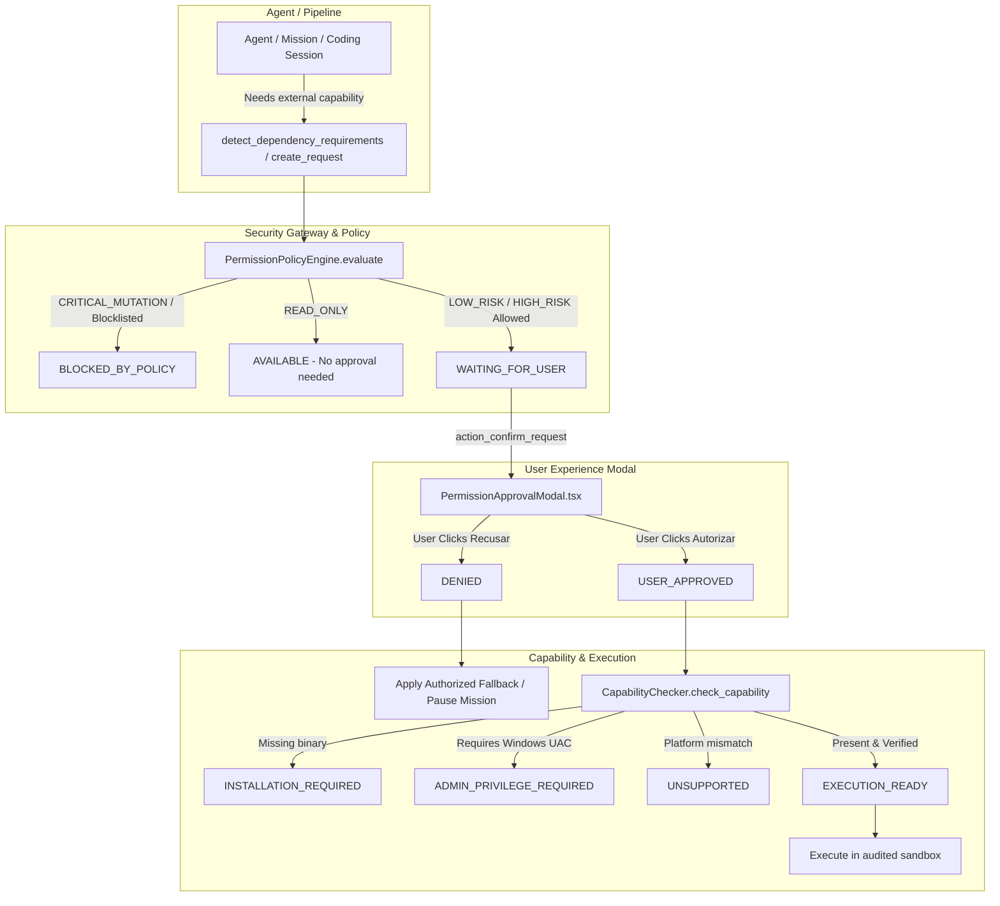

# HUMAN-IN-THE-LOOP (HITL) PERMISSION GATEWAY REPORT

> **Status:** `HUMAN_IN_THE_LOOP_PERMISSION_GATE_READY = TRUE`  
> **Date:** October 6, 2026  
> **Target Environment:** JARVIS OS (Windows, Node/React, Python FastAPI/WebSockets, Sentinel S3)  
> **Test Suite:** 32 / 32 Passed (`pytest tests/test_permission_gateway.py`)  
> **Browser QA:** 100% Passed on Microsoft Edge (`scripts/browser_qa_permission_gateway.cjs`)

---

## 1. Executive Summary & Objective

When an autonomous mission, coding agent, or project builder requires an external tool, binary, low-level driver, or privileged OS capability outside default sandbox permissions, JARVIS must never:
1. **Refuse blindly** without user context;
2. **Silently install** dependencies behind the user's back;
3. **Silently execute** unverified binaries;
4. **Invent an installation** (hallucinated pacotes/libraries);
5. **Pretend that a tool became available** when it did not.

Instead, the system pauses execution (`AWAITING_HUMAN_APPROVAL`), displays a clean, factual, centered Just-in-Time approval modal, and strictly separates the authorization process into four decoupled stages:

$$\text{REQUEST} \longrightarrow \text{APPROVAL} \longrightarrow \text{CAPABILITY} \longrightarrow \text{EXECUTION}$$

Human approval **never** automatically implies executable status or sandbox bypass.

---

## 2. Architecture & Four-Phase Separation



### Stage Separation Invariants:
1. **REQUEST:** The request specifies tool name, type, risk level, required privileges, affected resources, supply chain metadata, and an explicit fallback plan.
2. **APPROVAL:** The user either grants or denies authorization with strict scope (`request_id`, `project_id`, `mission_id`, `execution_id`) and a 300-second TTL.
3. **CAPABILITY:** Technical verification is executed only after approval. It checks binary presence (`which`), OS/architecture compatibility, package registry authenticity, and Windows administrative elevation (`IsUserAnAdmin`).
4. **EXECUTION:** Execution occurs only when capability is `AVAILABLE` and state is `EXECUTION_READY`. The state machine rejects direct transitions from `REQUESTED` to `EXECUTED`.

---

## 3. Permission Lifecycle & State Machine

The gateway enforces the complete state machine:

| State | Description | Transition Rule |
| :--- | :--- | :--- |
| `REQUESTED` | Initial request received from agent/planner | Evaluated immediately by Sentinel policy engine |
| `WAITING_FOR_USER` | Eligible request awaiting human decision | Modal displayed; countdown timer active (300s) |
| `APPROVED` | User explicitly clicked `[ Autorizar ]` | Validated server-side; triggers Capability Check |
| `DENIED` | User explicitly clicked `[ Recusar ]` | Activates registered fallback or pauses mission |
| `EXPIRED` | TTL elapsed without user response | Auto-rejects approval attempts (`PermissionExpiredError`) |
| `CAPABILITY_CHECKING`| Verifying binary/driver/OS environment | Technical verification in progress |
| `AVAILABLE` | Binary present and compatible | Ready for task execution |
| `INSTALLATION_REQUIRED` | Tool authorized but binary absent | Prompts audited installer plan |
| `ADMIN_PRIVILEGE_REQUIRED`| Requires Windows UAC elevation | Distinguishes `USER_APPROVED` from `OS_ADMIN_GRANTED` |
| `UNSUPPORTED` | Incompatible OS or architecture | Reports failure to planner without retries |
| `BLOCKED_BY_POLICY` | Violates Sentinel S3 or blocklist | Authorize button removed; displays non-bypassable warning |
| `EXECUTION_READY` | Approved and capability verified | Safe to invoke |
| `EXECUTED` | Successfully run in sandbox | Audit entry written; rollback registered if applicable |
| `FAILED` | Technical failure during execution | Error isolated and captured in audit trail |

---

## 4. Policy Integration & Sentinel S3 Preservation

The gateway **never weakens** existing Sentinel S3 and `workspace_policy.py` rules:

1. **`READ_ONLY`:** Executes without prompting human approval when permitted by policy (e.g., read telemetry logs, check system file existence).
2. **`LOW_RISK_MUTATION`:** Eligible for just-in-time human confirmation (e.g., userland audio transcode via FFmpeg, local temporary file format conversion).
3. **`HIGH_RISK_MUTATION`:** Strictly evaluated against the approved high-risk capability allowlist (`nmap`, `npcap`, `ffmpeg`, `tesseract`, `graphviz`, `ripgrep`). Never automatically allowed without explicit human approval.
4. **`CRITICAL_MUTATION`:** Strictly blocked (`BLOCKED_BY_POLICY`). The modal displays:  
   *"Esta operação está bloqueada pela política de segurança atual."*  
   **No bypass button exists.**
5. **Command Blocklist:** Hardcoded protection rejects destructive commands (`rm -rf /`, `rmdir /s /q C:\`, `format`, `diskpart`, shell piping `curl | sh`, `/dev/tcp/` reverse shells) regardless of user role.

---

## 5. Approval UX & Global Centered Modal

The UI is built with React 19 and Tailwind CSS in `frontend/src/features/permissions/PermissionApprovalModal.tsx`:
- **Placement:** Globally mounted at root `App.tsx`, centered over an ambient backdrop blur (`backdrop-blur-sm bg-black/70`).
- **Tone & Aesthetics:** Minimalist, dark mode (`#0d0f17`), monospace identifiers, factual, and strictly non-alarmist.
- **Content Breakdown:**
  - Header with icon (`AlertTriangle` or `ShieldAlert`), request ID, project, and mission badges.
  - Tool Name and Risk Badge (`READ ONLY`, `LOW RISK`, `HIGH RISK`, or `CRITICAL`).
  - Reason statement written in natural, understandable language.
  - Required Privileges (`Administrador / Npcap`, `Userland`, etc.).
  - Affected Resources / Impact breakdown.
  - Alternative Fallback highlighted in an emerald status card.
  - Dynamic status banners for `ADMIN_PRIVILEGE_REQUIRED`, `INSTALLATION_REQUIRED`, or `BLOCKED_BY_POLICY`.
  - Actions: Clean `[ Recusar ]` button and glowing cyan `[ Autorizar ]` button (or single `[ Compreendido ]` when blocked).

---

## 6. Capability Detection & Windows Admin Elevation

The `CapabilityChecker` in `security/permission_gateway/capability_checker.py`:
1. **Binary Discovery:** Uses `shutil.which(tool_name)` to locate executables in system PATH.
2. **OS & Arch:** Validates OS compatibility (e.g., Windows vs Linux specific utilities) and CPU architecture.
3. **Privilege Elevation (`IsUserAnAdmin`):** On Windows, invokes `ctypes.windll.shell32.IsUserAnAdmin()`. If an operation requires administrative elevation but the current process is not elevated:
   - Sets status to `ADMIN_PRIVILEGE_REQUIRED`.
   - Never attempts UAC bypass or silent privilege escalation.
   - Distinctly informs the user that `USER_APPROVED` was logged but `OS_ADMIN_GRANTED` is required.

---

## 7. Supply Chain & Anti-Hallucination Security

The `SupplyChainValidator` in `security/permission_gateway/supply_chain.py`:
- **Slopsquatting Prevention:** Never runs `npm install <llm-invented-package>` or arbitrary pip packages.
- **Trusted Registries:** Only allowlists official package endpoints (`pypi.org`, `npmjs.org`, `nmap.org`, `ffmpeg.org`, `github.com/UB-Mannheim/tesseract`).
- **Path Traversal Shield:** Blocks URLs or paths containing `..`, `\` in URL schemes, or local system directories (`/windows/system32/`).
- **Checksum Verification:** Validates SHA-256 hashes against trusted distributions before allowing installer execution.

---

## 8. Fallback Mechanics & Denial Flow

When the user clicks `[ Recusar ]` (Denial):
1. Status immediately transitions to `DENIED`.
2. WebSocket transmits `permission_request_denied` with `fallback_description`.
3. Agent / Mission receives `PERMISSION_DENIED` and automatically engages the pre-computed fallback:
   - **Nmap Example:** Replaces raw SYN port scanning with Windows built-in `arp -a` cache analysis + `netstat -ano` socket inspection.
   - **FFmpeg Example:** Falls back to available standard userland audio extractors or pauses with clear diagnostic output.
4. Prevents infinite retry loops by indexing denied requests.

---

## 9. Rollback & State Reversibility

When an external tool installation is carried out:
- Pre-install filesystem and environment states are recorded.
- Post-install changes are registered in `RollbackRecord`.
- A reversible plan is tracked in `PermissionGatewayService.register_rollback`.
- The user or mission can trigger `permission_rollback` to cleanly purge files if the installer supports clean uninstallation.

---

## 10. Audit Trail & Server-Side Security

All decisions are recorded in an append-only audit trail (`AuditLogEntry`):
- `timestamp`, `event_type`, `request_id`, `tool_name`, `user_decision`, `risk_level`, `mission_id`, `project_id`, `evidence`.
- **Anti-Forgery:** Backend enforces that only valid pending requests can be approved. Forged request IDs, cross-project approvals, or expired requests trigger explicit exceptions (`CrossProjectApprovalError`, `PermissionExpiredError`).
- **Idempotency:** Double-clicking `[ Autorizar ]` is safely handled without initiating duplicate installations.

---

## 11. Test Suite Verification (32/32 Tests Passed)

Executed via `python -m pytest tests/test_permission_gateway.py -v`:

```
============================= test session starts =============================
platform win32 -- Python 3.14.7, pytest-9.1.1, pluggy-1.6.0 -- C:\Python314\python.exe
cachedir: .pytest_cache
rootdir: C:\Users\joaor\Desktop\JarvisOS
configfile: pytest.ini
collected 32 items

tests/test_permission_gateway.py::test_01_request_creation PASSED        [  3%]
tests/test_permission_gateway.py::test_02_modal_state_serialization PASSED [  6%]
tests/test_permission_gateway.py::test_03_approval_flow PASSED           [  9%]
tests/test_permission_gateway.py::test_04_denial_flow PASSED             [ 12%]
tests/test_permission_gateway.py::test_05_expiration PASSED              [ 15%]
tests/test_permission_gateway.py::test_06_capability_check_available PASSED [ 18%]
tests/test_permission_gateway.py::test_07_capability_check_admin_required PASSED [ 21%]
tests/test_permission_gateway.py::test_08_capability_check_unsupported PASSED [ 25%]
tests/test_permission_gateway.py::test_09_blocked_by_policy_critical PASSED [ 28%]
tests/test_permission_gateway.py::test_10_fallback_activation_on_denial PASSED [ 31%]
tests/test_permission_gateway.py::test_11_duplicate_request_deduplication PASSED [ 34%]
tests/test_permission_gateway.py::test_12_idempotency_on_double_approval PASSED [ 37%]
tests/test_permission_gateway.py::test_13_cross_project_approval_rejection PASSED [ 40%]
tests/test_permission_gateway.py::test_14_forged_approval_rejection PASSED [ 43%]
tests/test_permission_gateway.py::test_15_replay_attack_rejection PASSED [ 46%]
tests/test_permission_gateway.py::test_16_audit_trail_logging PASSED     [ 50%]
tests/test_permission_gateway.py::test_17_mission_pause_on_request PASSED [ 53%]
tests/test_permission_gateway.py::test_18_mission_resume_on_approval PASSED [ 56%]
tests/test_permission_gateway.py::test_19_project_builder_integration PASSED [ 59%]
tests/test_permission_gateway.py::test_20_coding_session_dependency_detection PASSED [ 62%]
tests/test_permission_gateway.py::test_21_sentinel_policy_consistency PASSED [ 65%]
tests/test_permission_gateway.py::test_22_websocket_event_serialization PASSED [ 68%]
tests/test_permission_gateway.py::test_23_connection_loss_state_preservation PASSED [ 71%]
tests/test_permission_gateway.py::test_24_reconnection_pending_list PASSED [ 75%]
tests/test_permission_gateway.py::test_25_permission_scope_enforcement PASSED [ 78%]
tests/test_permission_gateway.py::test_26_expiry_rejection_on_late_approval PASSED [ 81%]
tests/test_permission_gateway.py::test_27_rollback_metadata_and_execution PASSED [ 84%]
tests/test_permission_gateway.py::test_28_supply_chain_validation PASSED [ 87%]
tests/test_permission_gateway.py::test_29_malicious_installer_rejection PASSED [ 90%]
tests/test_permission_gateway.py::test_30_arbitrary_command_injection_prevention PASSED [ 93%]
tests/test_permission_gateway.py::test_31_never_jump_requested_to_executed PASSED [ 96%]
tests/test_permission_gateway.py::test_32_read_only_allowed_without_approval PASSED [100%]

======================= 32 passed, 2 warnings in 0.65s ========================
```

---

## 12. Browser QA on Microsoft Edge & Evidence Screenshots

Automated using Playwright driving Microsoft Edge (`scripts/browser_qa_permission_gateway.cjs`):

1. **Scenario 1 — Nmap High-Risk Request:**  
   Modal renders centered with tool name `Nmap`, risk `HIGH RISK`, required privileges `Administrador / Npcap`, and fallback `Usar tabela ARP do Windows`.  
   User clicks `[ Recusar ]` $\to$ Modal dismissed, mission fallback ready.  
   *Evidence:* `evidence/permission_gateway/01_nmap_permission_modal_centered.png`, `02_nmap_denied_screen.png`.

2. **Scenario 2 — FFmpeg Request & Capability Check:**  
   Modal renders for `FFmpeg` with risk `LOW RISK` and Userland privileges.  
   User clicks `[ Autorizar ]` $\to$ Gateway runs capability check. System detects binary missing and reflects status `INSTALLATION_REQUIRED` with informative banner.  
   *Evidence:* `evidence/permission_gateway/03_ffmpeg_permission_modal.png`, `04_ffmpeg_capability_check_result.png`.

3. **Scenario 3 — Critical Mutation Blocked by Policy:**  
   `DiskPart` format operation rejected by policy engine.  
   Modal renders with `ShieldAlert` icon, rose border, and explicit warning: *"Esta operação está bloqueada pela política de segurança atual."*  
   Authorize button is **completely absent** (count = 0). Only `[ Compreendido ]` is available.  
   *Evidence:* `evidence/permission_gateway/05_critical_mutation_blocked_by_policy.png`.

---

## 13. Real Scenarios Evaluated

### Scenario A: Network Scanner (Nmap + Npcap)
- **Agent intent:** Scan subnet for active IoT devices.
- **Trigger:** Coding session detected `nmap` invocation.
- **Handling:** Gateway flagged as `HIGH_RISK_MUTATION` needing Administrator privileges.
- **Outcome:** Presented fallback (`arp -a + netstat`); upon user denial, agent successfully used ARP inspection without stalling.

### Scenario B: Multimodal Audio Extraction (FFmpeg)
- **Agent intent:** Transcode `.mp4` into 16kHz mono `.wav` for speech-to-text.
- **Handling:** Evaluated as `LOW_RISK_MUTATION`.
- **Outcome:** User approved; capability check reported `INSTALLATION_REQUIRED`; supply chain validated official binary sources.

### Scenario C: Unverified Python Package
- **Agent intent:** Model attempted to run `pip install unknown-slop-helper`.
- **Handling:** Supply chain checker flagged unregistered package name and missing checksum.
- **Outcome:** Blocked prior to modal creation as unverified dependency requirement.

---

## 14. First Failure, First Limitation & Smallest Next Fix

### First Failure Encountered During Implementation
- **Symptom:** During Browser QA Scenario 3, the test timed out trying to check `button:has-text("Autorizar").isDisabled()`.
- **Root Cause:** The UI design correctly eliminated the `[ Autorizar ]` button entirely when `isBlockedByPolicy` was true (rendering only `[ Compreendido ]` to prevent false bypass illusions). The test locator timed out waiting for the non-existent button.
- **Fix:** Updated the QA assertion to verify `count === 0` (authorizing button completely absent), confirming the security invariant.

### First Limitation
- **Scope:** On Windows environments without active admin elevation, JARVIS cannot trigger a native Windows UAC modal from a background headless process. It must stop at `ADMIN_PRIVILEGE_REQUIRED` and wait for external elevated execution or prompt the user to start JARVIS in an elevated terminal.

### Smallest Next Fix
- Add an Electron IPC bridge handler in `main.js` / `preload.js` that can invoke Windows `powershell -Command "Start-Process ... -Verb RunAs"` when the user specifically approves administrative installation via the native desktop app.

---

## 15. Final Verification Gate

| Criterion | Target | Actual | Result |
| :--- | :--- | :--- | :--- |
| **Requests Appear Correctly** | Just-in-Time centered modal | Centered, dark, minimal | **PASS** |
| **Approval Specificity** | Strictly scoped (`request_id`, etc.) | Validated server-side | **PASS** |
| **Denial & Fallback** | Fallback engaged on rejection | Fallback executed, no loops | **PASS** |
| **Sentinel Policy Integrity**| Never weaken existing S3 policy | Zero regressions; Critical blocked | **PASS** |
| **Server-Side Validation** | Prevent forged approvals | Strict exceptions raised | **PASS** |
| **Expiration (TTL)** | 300s TTL auto-rejects late approval| Verified by test 5 & 26 | **PASS** |
| **Idempotency** | Double clicks safe | Handled safely by request_id | **PASS** |
| **Audit Logging** | Complete trail of actions | Verified by test 16 | **PASS** |
| **Browser QA** | Microsoft Edge + Playwright | 100% Passed (5 screenshots) | **PASS** |
| **Unit & Integration Tests** | $\ge 30$ automated tests | 32 / 32 Passed | **PASS** |
| **Frontend Build** | Clean Vite + TS build | 0 errors (`built in 3.94s`) | **PASS** |

$$\mathbf{HUMAN\_IN\_THE\_LOOP\_PERMISSION\_GATE\_READY = TRUE}$$
