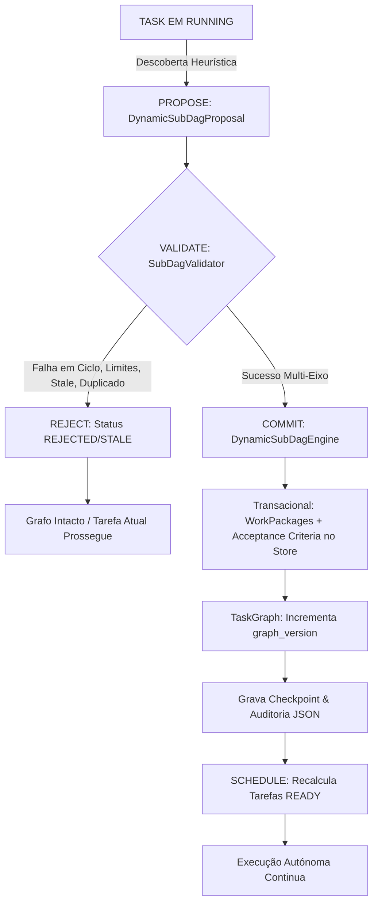

# JARVIS OS: Arquitectura de Dynamic Sub-DAG Expansion (Fase 12)

---

## 1. Visão Geral & Princípios Fundamentais

A **Fase 12 — Dynamic Sub-DAG Expansion** estende o ciclo de vida de missões do JARVIS OS permitindo que missões ativas expandam dinamicamente o seu Task Graph (DAG) durante o tempo de execução sem perder determinismo, integridade ou rastreabilidade.

### Princípio da Separação de Poderes
- **O Modelo (LLM)**: Atua exclusivamente como sensor e analista heurístico. Durante a execução, uma tarefa pode detetar lacunas arquiteturais, dependências em falta ou testes inexistentes e **propor** declarativamente um sub-DAG.
- **O Runtime Determinístico**: É a autoridade incondicional sobre:
  - Validação estrutural e semântica;
  - Rejeição de ciclos diretos, indiretos e cruzados;
  - Versionamento atómico do grafo (`graph_version`);
  - Deduplicação de tarefas redundantes;
  - Respeito pelos limites de expansão (`ExpansionLimits`);
  - Preservação intacta de tarefas em `RUNNING` e `COMPLETED`;
  - Agendamento de novas tarefas na fila `READY`;
  - Barreira de satisfação unificada com evidências canónicas.

---

## 2. Ciclo de Vida da Expansão

Toda e qualquer expansão segue estritamente o pipeline de cinco etapas:



### Estados de uma Proposta (`ProposalStatus`)
| Estado | Descrição |
| :--- | :--- |
| `PROPOSED` | Proposta submetida pelo executor de uma tarefa ou via WebSocket. |
| `VALIDATING` | Submetida à verificação multi-eixo de ciclo, versão, limites e escopo. |
| `ACCEPTED` | Aprovada pelo validador e pronta para integração. |
| `REJECTED` | Rejeitada por colisão de IDs, ciclo, violação de segurança ou limites excedidos. |
| `STALE` | Proposta submetida contra uma versão antiga do grafo cujo rebase falhou. |
| `APPLIED` | Integrada atomicamente no `TaskGraph` e persistida no `MissionStateStore`. |
| `FAILED` | Falha transacional de escrita que provocou rollback imediato. |

---

## 3. Gatilhos Canónicos de Expansão (`ExpansionTrigger`)

Uma expansão dinâmica não pode ocorrer por mero capricho do modelo; deve ser associada a um gatilho canónico tipado:

- `REQUIREMENT_DISCOVERY`: Descoberta de novo requisito funcional durante a análise/execução.
- `ARCHITECTURE_DISCOVERY`: Descoberta de que um módulo, contrato de API ou esquema de base de dados necessita de alteração.
- `VALIDATION_FAILURE`: Falha de validação ou linting que revela a necessidade de trabalho estrutural de refatoração prévia.
- `RUNTIME_DISCOVERY`: Exceção ou comportamento de runtime em ambiente local/sandbox.
- `BROWSER_DISCOVERY`: Falha em inspeção de elementos DOM ou console capturada pelo Browser QA.
- `DEPENDENCY_DISCOVERY`: Biblioteca ou serviço externo necessário identificado a meio do percurso.
- `MISSING_TEST`: Necessidade identificada de suites de testes adicionais para cobertura de regressão.
- `MISSING_IMPLEMENTATION`: Tarefa inicial descobre que falta uma biblioteca auxiliar ou utilitário interno.

---

## 4. Contratos de Dados

### `DynamicSubDagProposal`
```python
@dataclass
class DynamicSubDagProposal:
    proposal_id: str
    mission_id: str
    parent_task_id: str
    base_graph_version: int
    reason: str
    trigger: ExpansionTrigger
    tasks: list[dict[str, Any]]
    dependencies: list[tuple[str, str]]
    acceptance_criteria: list[dict[str, Any]]
    requested_scope: dict[str, Any]
    created_at: str
    status: ProposalStatus = ProposalStatus.PROPOSED
    rejection_reason: str = ""
```

### `ExpansionRecord` (Auditoria Imutável)
Persistido sequencialmente em `workspace/projects/<project_id>/.jarvis/missions/<mission_id>/expansions/expansion_XXXX.json`:
```json
{
  "proposal_id": "prop_a1b2c3d4",
  "mission_id": "m_search_feature",
  "parent_task_id": "task_frontend_search",
  "subdag_id": "subdag_f8e7d6c5",
  "graph_version_before": 1,
  "graph_version_after": 2,
  "trigger": "ARCHITECTURE_DISCOVERY",
  "reason": "Backend endpoint /api/v1/search is missing and must be implemented before frontend integration.",
  "tasks_added": [
    "dyn_task_backend_endpoint",
    "dyn_task_backend_tests"
  ],
  "edges_added": [
    ["dyn_task_backend_endpoint", "dyn_task_backend_tests"],
    ["dyn_task_backend_tests", "task_frontend_search"]
  ],
  "validation_result": {
    "status": "OK",
    "nodes_count": 2
  },
  "timestamp": "2026-09-02T20:20:00Z"
}
```

---

## 5. Salvaguardas & Limites de Expansão (`ExpansionLimits`)

Para impedir loops infinitos de expansão e crescimento arbitrário do grafo, aplicam-se restrições estritas:

| Limite | Valor Padrão | Descrição |
| :--- | :---: | :--- |
| `max_expansions_per_mission` | 10 | Número total de expansões permitidas numa única missão. |
| `max_tasks_per_expansion` | 10 | Número máximo de tarefas que uma única proposta pode introduzir. |
| `max_total_tasks` | 50 | Número máximo de tarefas acumuladas no grafo de uma missão. |
| `max_expansion_depth` | 3 | Profundidade máxima de aninhamento (sub-DAG de sub-DAG). |
| `max_expansions_per_parent_task` | 3 | Número máximo de expansões originadas pela mesma tarefa pai. |

Caso algum limite seja atingido, a proposta é imediatamente recusada com a mensagem canónica `expansion_limit_hit`.

---

## 6. Integridade Transacional (All-or-Nothing)

A aplicação do sub-DAG no `TaskGraph` e no `MissionStateStore` é estritamente atómica:
1. Uma cópia do grafo existente é mantida em memória antes de aplicar novos nós ou arestas.
2. Se qualquer falha ocorrer na inserção dos novos nós no grafo ou na criação dos registos no `MissionStateStore`, é acionado um rollback transacional que restaura o grafo ao estado prévio.
3. O `graph_version` só é incrementado se **todos** os nós, arestas e critérios forem persistidos com sucesso.

---

## 7. Concorrência e Resolução de Conflitos (Rebase)

- Todo o processamento de propostas é protegido por um `asyncio.Lock`.
- Se duas tarefas $A$ e $B$ em execução paralela propuserem expansões ambas baseadas na versão `v1`:
  1. A Proposta 1 de $A$ é processada primeiro, avançando o grafo para `v2`.
  2. A Proposta 2 de $B$ (baseada em `v1`) sofre uma tentativa de **rebase determinístico** contra `v2`.
  3. Se as novas tarefas e dependências forem disjuntas e não introduzirem ciclos nem colisões com `v2`, o rebase é aceite e o grafo avança para `v3`.
  4. Se houver conflito de dependências ou ciclo, a Proposta 2 é marcada como `STALE` e rejeitada (`REJECTED_STALE_GRAPH_VERSION`).

---

## 8. Persistência em Checkpoints & Crash Recovery

- Cada checkpoint persistente (`checkpoint_XXXX.json`) inclui:
  - `graph_version`: A versão exata do DAG no instante do snapshot.
  - `expansion_history`: A lista cronológica de todos os `ExpansionRecord`s aceites.
- Ao reiniciar após um crash inesperado do processo:
  - O orquestrador restaura o grafo na sua versão mais recente (ex: `v3`), sem nunca regredir para `v1`.
  - Tarefas `COMPLETED` permanecem concluídas e nunca são reexecutadas.
  - Tarefas que estavam em `RUNNING` durante o crash são marcadas como `INTERRUPTED` e repostas em `READY`.

---

## 9. Barreira de Satisfação & Salvaguardas Económicas

1. **Critérios Dinâmicos**: Critérios de aceitação introduzidos por sub-DAGs são registados no `MissionStateStore` e associados às tarefas respetivas. A missão só pode atingir `COMPLETED` quando todos os critérios (iniciais e expandidos) possuírem evidências válidas.
2. **Missões Económicas**: Missões que envolvam fluxos financeiros atravessam o mesmo pipeline rigoroso. A expansão dinâmica não contorna a verificação de limites orçamentais (`BudgetLimit`) nem autoriza sintetização fictícia de receita.
