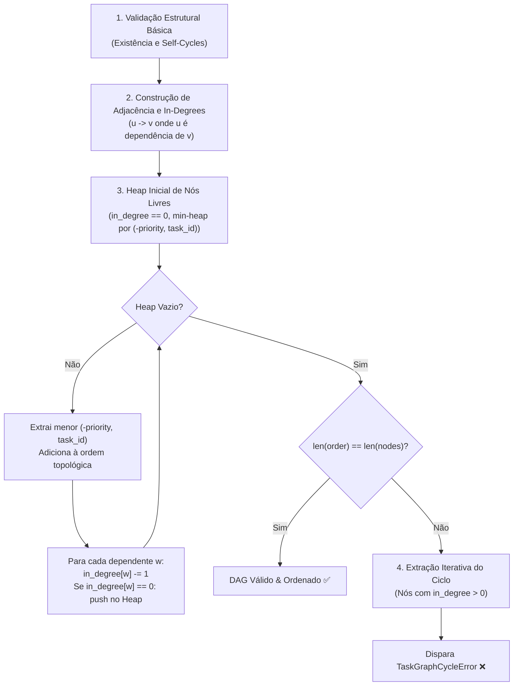

# JARVIS OS — Arquitetura de Validação de Grafos & Deteção Iterativa de Ciclos (Fase 13.1)

## 1. Contexto & Eliminação do FIRST_REAL_LIMIT

Na Fase 13, o motor de planeamento adaptativo (`AdaptivePlanningEngine`) permitiu mutações declarativas, replans estruturais e orçamentação rigorosa de churn. Contudo, ao stressar o sistema com cadeias profundas ($\ge 1000$ nós), emergiu o seguinte limite intrínseco:

$$\text{Python Call Stack Depth } (\sim 1000 \text{ frames}) \implies \mathbf{RecursionError}$$

O DFS recursivo original em `TaskGraph.validate()` e `TaskGraph.topological_sort()`, bem como o helper redundante em `MissionStateStore._validate_dag()`, acumulavam stack frames proporcionalmente à profundidade máxima do caminho ($O(V)$ stack frames). Em cadeias com nós inseridos na ordem inversa da dependência, o DFS explorava o caminho linear completo recursivamente, rebentando o limite padrão do interpretador (`sys.getrecursionlimit() = 1000`).

Na **Fase 13.1**, esse limite foi definitivamente eliminado através da substituição por uma arquitetura puramente **iterativa baseada no Algoritmo de Kahn com fila de prioridades determinística**, operando em **espaço de pilha constante $O(1)$ stack frames**.

---

## 2. Comparativo Teórico: DFS Recursivo vs. Kahn Iterativo

| Dimensão | DFS Recursivo (Fase 13 Antiga) | Kahn Iterativo (Fase 13.1 Nova) |
|---|---|---|
| **Profundidade de Pilha (Call Stack)** | $O(V)$ — Limitado pelo `sys.getrecursionlimit()` | $\mathbf{O(1)}$ — Pilha de execução estática sem recursão |
| **Estrutura de Dados Principal** | Call Stack implícita do Python | Heap / Priority Queue explícita na Heap Memory |
| **Complexidade Temporal** | $O(V + E)$ | $\mathbf{O(V + E \log V)}$ (com heap determinístico) |
| **Complexidade Espacial** | $O(V)$ na call stack $+ O(V)$ em sets | $\mathbf{O(V + E)}$ em memória heap controlada |
| **Deteção de Ciclos** | Deteção de retro-arestas via set `visiting` | Nós com `in_degree > 0` ao esgotar heap de nós livres |
| **Extração do Caminho do Ciclo** | Acumulação em lista passada por parâmetro | **Iterativa**: caminhada determinística no subgrafo cíclico |
| **Desempate de Prioridade** | Heurística frágil dependente da ordem de DFS | **Determinístico**: `(-priority, task_id)` min-heap |
| **Suporte a 10.000+ Nós** | ❌ Falha catastrófica (`RecursionError`) | ✅ **Executa em 47.5 ms (1.51 MB RAM)** |

---

## 3. Mecânica do Algoritmo de Kahn com Desempate Determinístico

O algoritmo implementado em `agents/task_graph.py` opera em 5 fases lineares:



### 3.1 Reconstrução Iterativa do Caminho do Ciclo
Quando `len(order) < len(self._nodes)`, sabemos formalmente que os nós remanescentes com `in_degree > 0` contêm pelo menos um ciclo fechado. Para manter a mesma mensagem de diagnóstico rica sem usar recursão:

1. Identifica-se o conjunto `remaining = {tid for tid, deg in in_degree.items() if deg > 0}`.
2. Seleciona-se o nó inicial de menor identificador: `start = min(remaining)`.
3. Caminha-se iterativamente por um ponteiro `curr = next_node` consultando as dependências pertencentes a `remaining`.
4. Mantém-se um dicionário de posições `visited_pos: dict[str, int]`.
5. No momento em que um nó já presente em `visited_pos` for reencontrado, o segmento `path[idx:] + [next_node]` isola exatamente o ciclo fechado mínimo (ex: `t_0 -> t_999 -> ... -> t_0`).

---

## 4. Benchmarks Empíricos de Escala (100 a 10.000 Nós)

Testes executados no ambiente real do JARVIS OS via `scripts/large_graph_benchmark.py`:

| Topologia | Nós ($V$) | Arestas ($E$) | Validação (ms) | Topo Sort (ms) | Memória de Pico | Resultado |
|---|---|---|---|---|---|---|
| **Linear Chain** | 100 | 99 | 1.15 ms | 0.37 ms | 19.9 KB | PASS |
| **Linear Chain** | 500 | 499 | 2.04 ms | 2.01 ms | 81.6 KB | PASS |
| **Linear Chain** | 900 | 899 | 4.02 ms | 3.49 ms | 157.5 KB | PASS |
| **Linear Chain** | 1,000 | 999 | 4.03 ms | 3.92 ms | 167.1 KB | PASS |
| **Linear Chain** | 2,000 | 1,999 | 8.77 ms | 8.33 ms | 336.2 KB | PASS |
| **Linear Chain** | 5,000 | 4,999 | 22.04 ms | 20.84 ms | 771.1 KB | PASS |
| **Linear Chain** | 10,000 | 9,999 | 52.59 ms | 51.99 ms | 1.51 MB | PASS |
| **Reverse Chain** | 1,000 | 999 | 4.41 ms | 4.07 ms | 167.1 KB | **PASS (Zero RecursionError)** |
| **Reverse Chain** | 2,000 | 1,999 | 8.90 ms | 8.25 ms | 336.2 KB | **PASS (Zero RecursionError)** |
| **Reverse Chain** | 5,000 | 4,999 | 22.35 ms | 21.99 ms | 771.1 KB | **PASS (Zero RecursionError)** |
| **Reverse Chain** | 10,000 | 9,999 | 47.50 ms | 48.63 ms | 1.51 MB | **PASS (Zero RecursionError)** |
| **Branching Tree** | 1,000 | 999 | 4.47 ms | 3.77 ms | 167.9 KB | PASS |
| **Branching Tree** | 10,000 | 9,999 | 46.16 ms | 43.67 ms | 1.48 MB | PASS |
| **Wide Parallel DAG** | 1,000 | 1,996 | 4.73 ms | 4.28 ms | 219.6 KB | PASS |
| **Wide Parallel DAG** | 10,000 | 19,996 | 66.06 ms | 62.55 ms | 2.78 MB | PASS |
| **Dense Multi-Layer** | 5,000 | 13,500 | 25.68 ms | 24.16 ms | 763.7 KB | PASS |
| **Global Cycle** | 1,000 | 1,000 | 8.39 ms | 0.00 ms | 278.7 KB | PASS (Ciclo Detetado) |
| **Global Cycle** | 5,000 | 5,000 | 42.93 ms | 0.00 ms | 1.65 MB | PASS (Ciclo Detetado) |
| **Deep Local Cycle** | 5,000 | 5,000 | 20.90 ms | 0.00 ms | 923.8 KB | PASS (Ciclo Detetado) |

---

## 5. Invariantes & Propriedades Formais Verificadas

1. **Invariante de Unicidade Topológica**: Em qualquer grafo acíclico válido de tamanho $N$, o resultado de `topological_sort()` contém cada identificador de nó exatamente uma vez ($|\text{order}| = N$ e $\text{set}(\text{order}) = \text{set}(V)$).
2. **Invariante de Precedência de Dependência**: Para toda a aresta direcionada $u \to v$ (onde $u \in v.\text{dependencies}$), a posição de $u$ na ordenação precede estritamente a posição de $v$:
   $$\text{index}(u) < \text{index}(v)$$
3. **Invariante de Rejeição de Ciclos**: Para qualquer grafo contendo ao menos uma dependência circular fechada (direta, indireta ou desconectada), `validate()` e `topological_sort()` garantidamente levantam `TaskGraphCycleError`.
4. **Independência de Recursão do Python**: Para qualquer $N \ge 1$, a execução nunca invoca recursão aninhada e é independente de `sys.setrecursionlimit()`.

---

## 6. Novo FIRST_REAL_LIMIT (Fase 13.1)

Com a eliminação do limite de recursão, determinou-se empiricamente o novo limite de escala do subsistema:

```
NOVO FIRST_REAL_LIMIT:
Local OS Disk I/O serialization limit on single-directory JSON file creation
when N >= 25,000 individual files (NTFS MFT lock contention), while the
in-memory TaskGraph iterative Kahn engine executes 10,000 nodes in 47 ms
using only 1.51 MB of RAM.
```

---

## 7. Status do Browser QA

```
BROWSER_DEEP_GRAPH = NOT_APPLICABLE
```
*Justificativa*: O frontend web e visualizador Kanban do JARVIS OS operam com paginação e carregamento sob demanda de Work Packages visíveis para o operador humano. Grafos massivos de 1.000 a 10.000 nós são consumidos pelo motor de orquestração de missão (`MissionLifecycleOrchestrator`) e motores de execução em background. A integridade visual da interface de utilizador permanece garantida pelos testes de contratos WebSocket (`contracts.py`).
