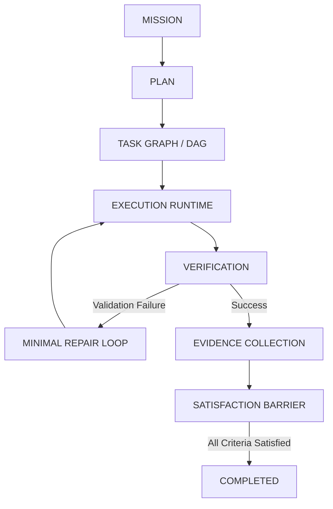
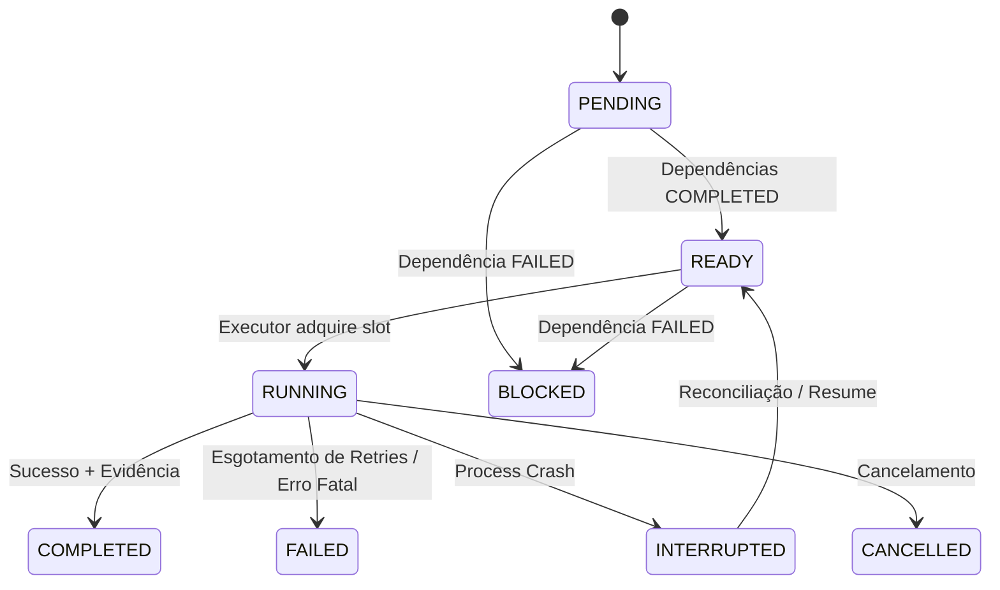
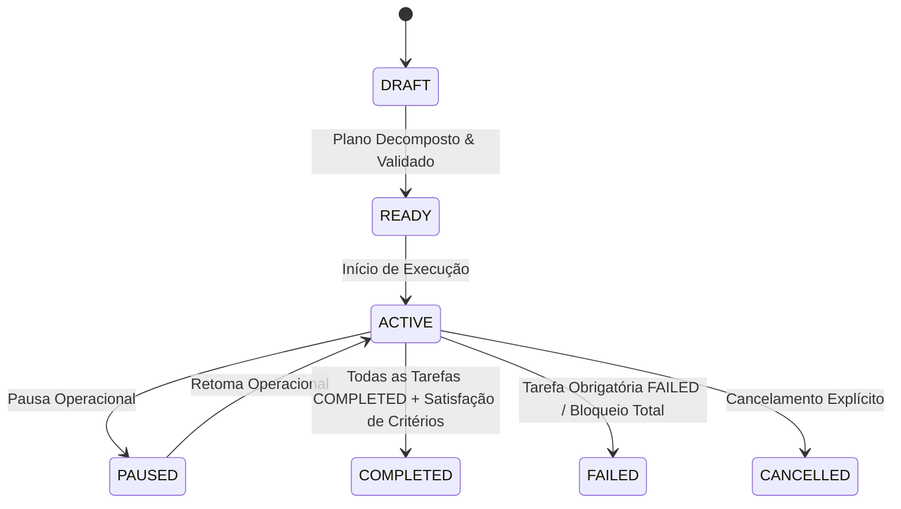

# JARVIS OS — Arquitetura de Lifecycle de Missões & Orquestração Autónoma (Fase 10.7)

## 1. Visão Geral & Filosofia de Desenho

A Fase 10.7 consolida a evolução do sistema de missões do JARVIS OS, estabelecendo uma fundação determinística, observável e resiliente para execução autónoma de missões multi-etapa de longo horizonte.

O princípio orientador central é a separação estrita de responsabilidades:
- **Modelo de IA / LLM**: Propõe planos, decompõe objetivos em subtarefas, elabora hipóteses, diagnostica falhas e sugere reparações de código pontuais.
- **Runtime Determinístico**: Controla incondicionalmente os estados, grafo de dependências (DAG), transições, concorrência, timeouts, checkpoints em disco, recuperação após crash, retries com backoff, cancelamento, pausa/retoma e a barreira final de satisfação de critérios de aceitação.

---

## 2. Grafo de Tarefas Determinístico (DAG)

O motor de DAG (`agents/task_graph.py`) gere a ordem e resolução de dependências entre tarefas:

### Estados Canónicos de Tarefas
- `PENDING`: Tarefa registada no plano cujas dependências ainda não foram concluídas.
- `READY`: Todas as dependências concluídas com sucesso (`COMPLETED`); pronta para execução na fila.
- `RUNNING`: Em execução ativa pelo runtime (sob semáforo de concorrência limitada).
- `COMPLETED`: Concluída com sucesso e verificada.
- `FAILED`: Falhou após esgotamento de retries ou falha permanente.
- `BLOCKED`: Bloqueada deterministicamente porque uma dependência direta ou indireta falhou (`BLOCKED_BY_DEPENDENCY`).
- `CANCELLED`: Cancelada por ordem explícita do utilizador ou operador.
- `SKIPPED`: Ignorada por não ser obrigatória num ramo condicional.
- `INTERRUPTED`: Tarefa que se encontrava em `RUNNING` no momento de uma falha de processo / crash, reconciliada na inicialização subsequente.

### Invariantes do Grafo
1. **Deteção de Ciclos**: Algoritmo DFS com conjuntos `visiting` e `visited`. Ciclos diretos, indiretos ou auto-dependências são rejeitados com `TaskGraphCycleError`.
2. **Propagação de Bloqueio**: Se uma tarefa $A$ falhar, todos os nós a jusante que dependem de $A$ transitam para `BLOCKED`, nunca para `FAILED` (garantindo precisão causal de telemetria).
3. **Execução Paralela**: Tarefas sem interdependências são identificadas automaticamente e executadas concorrentemente até ao limite configurado (`concurrency_limit`).

---

## 3. Máquina de Estados da Missão

O orquestrador (`agents/mission_orchestrator.py`) controla o ciclo de vida global da missão:

---

## 4. Checkpoints Persistentes e Recuperação de Falhas (Crash Recovery)

Para suportar missões longas e reboots do processo sem perda de progresso:
1. **Snapshots em Disco**: Guardados sequencialmente em `workspace/projects/<project_id>/.jarvis/missions/<mission_id>/checkpoints/checkpoint_XXXX.json`.
2. **Reconciliação Automática**:
   - O orquestrador carrega o checkpoint mais recente.
   - Tarefas que estavam em `RUNNING` no instante do crash são identificadas em `checkpoint.running_task_ids`.
   - São convertidas para `INTERRUPTED` e, se elegíveis para retry transitório, repostas como `READY`.
   - Tarefas com estado `COMPLETED` são integralmente preservadas e **nunca** reexecutadas (idempotência estrita).

---

## 5. Política Determinística de Retry & Minimal Repair Loop

As falhas são categorizadas formalmente (`FailureCategory`):
- `TRANSIENT_FAILURE`: Erros de rede, timeouts temporários ou recursos ocupados $\to$ Retry automático com backoff exponencial.
- `VALIDATION_FAILURE`: Erros de sintaxe, tipos ou asserções de teste $\to$ Invoca o **Minimal Repair Loop** (correção pontual e cirúrgica do artefacto) antes do próximo retry.
- `PERMANENT_FAILURE`: Erros de hardware, permissões em falta ou falhas irrecuperáveis $\to$ Marcação imediata de `FAILED` sem retries inúteis.
- `POLICY_BLOCK`: Bloqueio por política de segurança (ex: Sentinel Sandbox violation) $\to$ Aborto imediato da tarefa.
- `TIMEOUT`: Excedido o limite de tempo da tarefa $\to$ Retry configurável com backoff.
- `DEPENDENCY_FAILURE`: Falha de pré-requisito $\to$ Transição a jusante para `BLOCKED`.

---

## 6. Barreira de Satisfação & Evidências

Uma missão **nunca** é marcada como `COMPLETED` apenas por ausência de erros. O runtime exige:
1. `task_graph.is_all_completed()`: Todas as tarefas obrigatórias concluídas.
2. `verify_satisfaction()`: Todos os registos de `AcceptanceCriterion` em `MissionStateStore` devem possuir estado `SATISFIED` associado a referências de `Evidence` verificadas (logs de execução, resultados de testes, hashes de artefactos).

---

## 7. Salvaguardas Económicas (Money Pipeline)

Missões marcadas como `is_economic: True`:
- Atravessam rigorosamente o mesmo pipeline determinístico de DAG e checkpoints.
- É estritamente proibido sintetizar métricas de receita sem confirmação bancária ou liquidação externa verificável.
- Cada etapa financeira requer evidência auditável do nível mais elevado antes da satisfação do critério correspondente.
