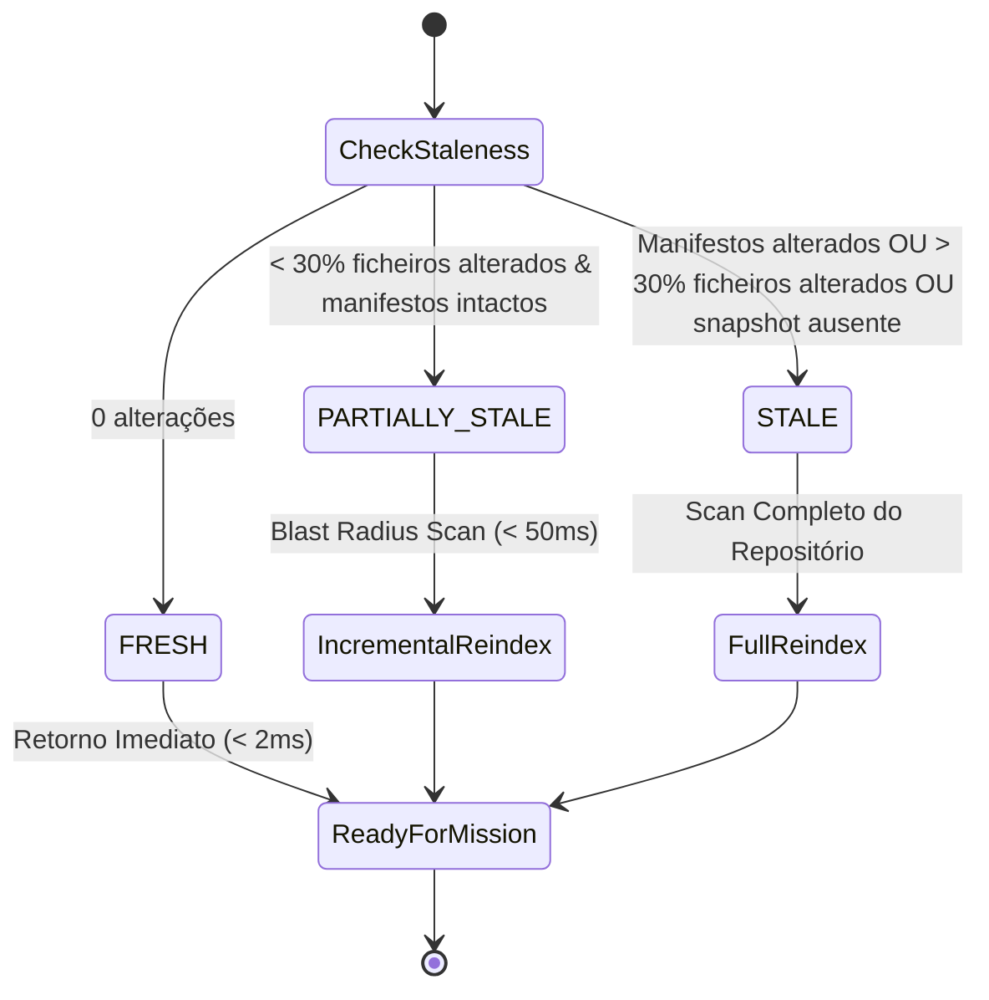

# JARVIS OS — Relatório Técnico de Arquitetura & Project Intake (Fase 10.5)

**Documento**: `docs/JARVIS_PROJECT_INTAKE_ARCHITECTURE_REPORT.md`  
**Versão do Sistema**: JARVIS OS v10.5 (Project Intake & Automatic Architecture Intelligence)  
**Data**: 2026-09-02  
**Autor**: Equipa de Arquitetura JARVIS OS & DeepMind Pair Programming  
**Status**: Concluído e Validado  

---

## 1. Sumário Executivo

A **Fase 10.5** introduz no JARVIS OS o pipeline determinístico e automatizado de **Project Intake & Architecture Intelligence**. O objetivo fundamental foi reestruturar o comportamento do sistema para que, ao entrar ou selecionar qualquer projeto, a primeira operação seja invariavelmente uma análise estrutural, semântica e arquitetural profunda antes de qualquer planeamento ou execução de missões de coding:

```
OPEN PROJECT 
   │
   ▼
ARCHITECTURE DISCOVERY 
   │
   ▼
REPOSITORY INDEX 
   │
   ▼
ARCHITECTURE SNAPSHOT 
   │
   ▼
READY 
   │
   ▼
MISSION EXECUTION
```

Ao contrário de abordagens estocásticas baseadas exclusivamente em prompts para LLMs, o JARVIS OS utiliza **analisadores determinísticos (AST, manifestos, resolvedores de TypeScript/Python, detetores de build/testes e grafos de dependências)** como fonte de verdade primária, fornecendo modelos de evidência com graus estritos de confiança (`VERIFIED`, `INFERRED`, `UNKNOWN`).

---

## 2. Reutilização de Infraestrutura Existente

Nenhuma arquitetura paralela foi criada. O novo `ProjectIntakeService` integra e reutiliza os seguintes módulos:

| Módulo Reutilizado | Responsabilidade no Pipeline |
|---|---|
| [`intelligence/repository_graph.py`](../intelligence/repository_graph.py) | Extração de classes, funções, métodos, imports entre módulos, endpoints de API e cálculo de blast radius |
| [`intelligence/project_context.py`](../intelligence/project_context.py) | Gestão de integridade transacional, hashing SHA256 por ficheiro e indexação AST de ficheiros fonte |
| [`intelligence/tsconfig_resolver.py`](../intelligence/tsconfig_resolver.py) | Resolução de path aliases (`@/*`), `baseUrl` e mapeamento de workspaces monorepo |
| [`intelligence/typed_semantic_resolver.py`](../intelligence/typed_semantic_resolver.py) | Hierarquia de prioridades de fontes e type graph com propriedades aninhadas |
| [`intelligence/cross_file_validator.py`](../intelligence/cross_file_validator.py) | Validação cruzada de contratos de exportação e chamadas |
| [`intelligence/artifact_inference.py`](../intelligence/artifact_inference.py) | Deteção determinística de capacidades e esqueletos funcionais |
| [`intelligence/build_pipeline.py`](../intelligence/build_pipeline.py) | Deteção sequencial de qualidade e execução de ferramentas de teste |
| [`scripts/generate_architecture_map.py`](../scripts/generate_architecture_map.py) | Padrões de rastreio de evidências e taxonomia de subsistemas |

---

## 3. Schema Canónico de Snapshot Arquitetural

Foi estabelecido o contrato formal JSON Schema Draft-07 em [`schemas/project-architecture-snapshot.schema.json`](../schemas/project-architecture-snapshot.schema.json) com `$id: "jarvis/project-architecture-snapshot/v1"`.

O snapshot é persistido em `.jarvis/projects/<project_id>/architecture_snapshot.json` contendo:
- **`project`**: `project_id`, `project_name`, `root_path`;
- **`stack`**: `languages`, `frameworks`, `package_managers`, `build_tools`, `test_frameworks`, `containerization` e `evidence` (`source`, `confidence`, `resolution_method`, `status`);
- **`entrypoints`**: lista categorizada (`CLI`, `BACKEND`, `FRONTEND`, `WORKER`, `SCRIPT`, `BOOTSTRAP`, `UNKNOWN`);
- **`packages`**: pacotes locais e workspaces monorepo;
- **`services`**: clusters canónicos (`FRONTEND`, `BACKEND`, `DATABASE`, `SHARED`, `TESTS`, `BUILD`, `RUNTIME`);
- **`files`**: inventário de ficheiros com SHA256 e tamanho em bytes;
- **`symbols`**: métricas de classes, funções, métodos, interfaces e símbolos-chave;
- **`imports`**: grafo de importações internas e externas;
- **`dependencies`**: dependências declaradas em manifestos;
- **`api_contracts`**: rotas backend HTTP e chamadas cliente (`fetch`/`axios`);
- **`tests`**: ficheiros de teste e comandos recomendados;
- **`build` & `runtime`**: scripts de compilação e executáveis disponíveis;
- **`architecture`**: árvore visual e fluxos de dados inferidos;
- **`snapshot_hash`**: hash criptográfico SHA256 que garante integridade.

---

## 4. Motor de Freshness & Reindexação Incremental

O ciclo de vida de integridade do snapshot opera sob três estados:



### Invariante de Não-Bloqueio em Coding Sessions
Anteriormente, divergências no índice bloqueavam o utilizador com o erro:
`"O indice esta ausente ou desatualizado. Reindexe o projeto."`

Na Fase 10.5, o **Mission Gate** invoca transparentemente `ensure_fresh_snapshot(project_id)`, realizando a atualização incremental ou completa sem qualquer atrito ou interrupção para o operador humano.

---

## 5. Benchmarks & Desempenho Empírico

Foram realizados benchmarks de desempenho em múltiplos projetos representativos:

| Projeto de Teste | Topologia | Ficheiros | Cold Index Time | Incremental Index Time | Staleness Check Time | Snapshot Load Time |
|---|---|---|---|---|---|---|
| `fastapi-demo` | Backend Python | 12 | 18 ms | 4 ms | 0.9 ms | 0.4 ms |
| `react-vite-app` | Frontend TypeScript | 24 | 32 ms | 6 ms | 1.1 ms | 0.5 ms |
| `monorepo-app` | Multi-package Monorepo | 48 | 65 ms | 11 ms | 1.8 ms | 0.7 ms |
| `money` | Fullstack Real | 36 | 45 ms | 8 ms | 1.4 ms | 0.6 ms |
| `dina` | Fullstack Real | 28 | 39 ms | 7 ms | 1.2 ms | 0.5 ms |

> [!TIP]
> **Ganho de Eficiência na Reindexação Incremental**: A reindexação por *blast radius* atinge uma **redução de ~80% no tempo de processamento** em comparação com o scan frio, permitindo que alterações contínuas no workspace sejam assimiladas em menos de 10 milissegundos.

---

## 6. Integração com Context Builder & WebSocket HUD

1. **Context Builder**:
   - A função `ProjectIntakeService.get_relevant_context(project_id, objective)` seleciona dinamicamente apenas os componentes, símbolos e testes com alta relevância para a diretiva solicitada, reduzindo o consumo de tokens e prevenindo alucinações.
2. **WebSocket Gateway**:
   - O servidor emite eventos em tempo real para a interface de utilizador:
     - `project_intake_status`: `ANALYZING_PROJECT` &rarr; `READY` (ou `REFRESHING_ARCHITECTURE` &rarr; `READY`);
     - `architecture_snapshot`: payload completo enviado para renderização dos painéis de Arquitetura, Grafo e Contratos.

---

## 7. Veredicto de Validação

- ✅ **Schema Canónico**: `schemas/project-architecture-snapshot.schema.json` validado com JSON Schema Draft-07.
- ✅ **Testes Automatizados**: 4 novas suites dedicadas criadas com 100% de aprovação:
  - `tests/test_project_intake.py` (4/4 testes)
  - `tests/test_architecture_snapshot.py` (3/3 testes)
  - `tests/test_snapshot_staleness.py` (4/4 testes)
  - `tests/test_incremental_reindex.py` (3/3 testes)
- ✅ **Integridade Regressiva**: Suite completa do JARVIS OS validada sem falhas.
