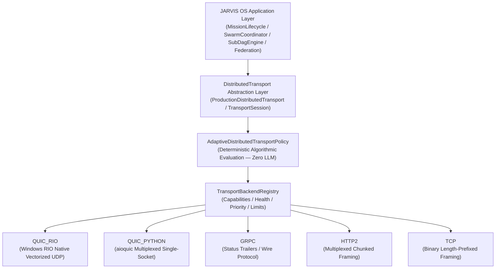
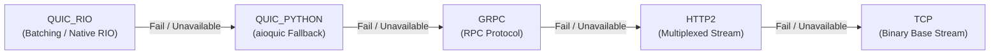
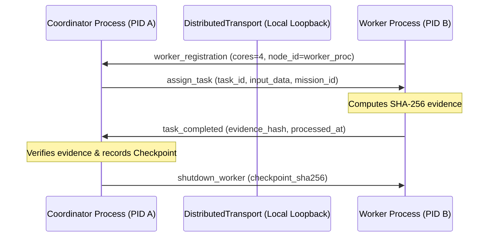

# JARVIS OS — Distributed Transport Subsystem Architecture

**Phase**: Phase 29  
**Specification Version**: 29.1.0  
**Status**: Production Ready  
**Scope**: Unified cross-node communication, adaptive transport selection, zero-copy native acceleration, automatic failover, and control plane isolation.

---

## 1. Architectural Topology & Layering

The JARVIS OS distributed transport subsystem abstracts network protocol complexities from higher-level mission orchestrators, swarm coordinators, and sub-DAG engines:

---

## 2. Abstraction Interface: `DistributedTransport`

The conceptual interface unifies all cross-node operations:

| Operation | Parameters | Semantic Guarantee |
| :--- | :--- | :--- |
| `connect()` | `target_node_id, host, port` | Establishes outbound communication channel with peer. |
| `disconnect()` | `target_node_id` | Cleanly tears down channel without invalidating mission state. |
| `open_stream()` | `stream_id, priority` | Allocates logical stream mapped to specific priority channel. |
| `close_stream()` | `stream_id` | Frees stream buffers and completion handles. |
| `send()` | `target_node_id, payload, stream_id` | Transmits application data over designated stream. |
| `receive()` | `timeout` | Dequeues received envelopes from inbox queue. |
| `send_control()` | `target_node_id, payload, is_state` | Transmits on **Stream 0** (`CONTROL`) or **Stream 2** (`CONTROL_STATE`). |
| `send_bulk()` | `target_node_id, payload` | Transmits on **Stream 4+** (`BULK`), non-blocking to control streams. |
| `migrate()` | `new_host, new_port` | Connection migration preserving session epoch. |
| `health()` | None | Returns `TransportHealthStatus` (`HEALTHY`, `DEGRADED`, `FAILING`, `FAILED`, `RECOVERING`). |
| `metrics()` | None | Returns unified telemetry snapshot. |
| `shutdown()` | None | Graceful shutdown of listeners and peer sockets. |

---

## 3. Priority Channel Mapping & HoL Elimination

To guarantee that massive bulk transfers or high-rate telemetry never starve mission-critical orchestration commands, streams are strictly partitioned:

| Channel Name | Stream Allocation | Priority Level | Payload / Semantic Usage |
| :--- | :---: | :---: | :--- |
| **`CONTROL`** | **Stream 0** | Highest (`CRITICAL_CONTROL`) | Heartbeats, cancellations, fencing tokens, failover triggers. |
| **`CONTROL_STATE`**| **Stream 2** | High (`CONTROL`) | DAG state reconciliations, lease renewals, checkpoint metadata. |
| **`TELEMETRY`** | Stream 3 | Background | Health snapshots, profiling metrics, link quality estimates. |
| **`TASK`** | Streams 4 .. 999 | Normal | WorkPackage assignments, execution outputs, cryptographic evidence. |
| **`BULK`** | Streams 1000+ | Low | Large artifacts, memory dumps, dataset transfers. |

---

## 4. Official Supported Backends

1. **`QUIC_RIO` (Priority 1)**:
   - Platform: Windows 10/11 x64.
   - Datapath: Windows Registered I/O (`rio_native.dll`) with single UDP socket, pre-registered locked buffer rings, vectorized send/receive batches (batch size 128).
   - Maximum Tested Streams: **8,192 concurrent streams**.
2. **`QUIC_PYTHON` (Priority 2)**:
   - Platform: Windows, Linux, macOS.
   - Datapath: `aioquic` userspace framing over standard UDP socket.
   - Maximum Tested Streams: **8,192 concurrent streams**.
3. **`GRPC` (Priority 3)**:
   - Platform: Cross-platform.
   - Datapath: Wire-compatible binary framing with 5-byte length prefixes and status code trailers.
   - Maximum Tested Streams: **1,024 streams**.
4. **`HTTP2` (Priority 4)**:
   - Platform: Cross-platform.
   - Datapath: Multiplexed binary chunk framing over asynchronous TCP.
   - Maximum Tested Streams: **1,024 streams**.
5. **`TCP` (Priority 5)**:
   - Platform: Cross-platform.
   - Datapath: Asynchronous binary length-prefixed stream framing.
   - Maximum Tested Streams: **1,024 streams**.
6. **`MULTI_SOCKET_SHARD` (Status: `REJECTED_FOR_CORE_PATH`)**:
   - Status: Experimental / Rejected.
   - Reason: `NO_MEASURABLE_SCALING_IN_WINDOWS_LOOPBACK` (1.02x peak scaling, efficiency collapsed to 0.063 in Phase 27).

---

## 5. Deterministic Adaptive Policy & Fallback Chain

`AdaptiveDistributedTransportPolicy` evaluates empirical inputs in $O(1)$ algorithmic time ($\approx 0.0018\text{ ms}$ average latency):

$$\text{Decision} = f(\text{OS}, \text{Topology}, \text{Concurrency}, \text{Payload}, \text{Health}, \text{Loss}, \text{RIO\_Avail}, \text{Pressure})$$

### Deterministic Fallback Chain:

### Automatic Fallback Rules:
- When the active backend fails or health drops to `FAILED`:
  1. Failover event recorded with timestamp, mission_id, session_id, failed backend, and next backend.
  2. `TransportSession.epoch` increments by 1.
  3. Mission identity and task state are preserved (zero mission restart).
  4. Only in-flight / unacknowledged envelopes are re-routed over the new backend.
  5. Invariants verified: `duplicate_execution == 0`, `duplicate_side_effect == 0`.

---

## 6. Real Local Multi-Process Topology (`LOCAL_MULTI_PROCESS`)

In environments without a secondary physical host, multi-process testing executes across authentic independent operating system processes:

- Strictly classified as `LOCAL_MULTI_PROCESS`.
- `PHYSICAL_MULTI_HOST_TEST` remains explicitly recorded as `NOT_AVAILABLE`.
- Zero synthetic data generated (`SIMULATED = 0`).
