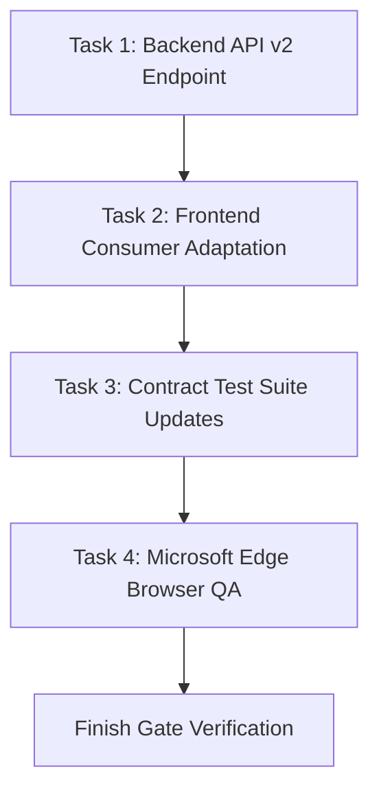

# JARVIS OS — RELATÓRIO DE ENGENHARIA & GOVERNAÇÃO TÉCNICA
## Fase 48: Contract-Aware Autonomous Change Management

---

### 1. OBJETIVO DA FASE 48

A **Fase 48** integra operacionalmente todo o sistema de contratos construído nas Fases 44 a 47 com o **Autonomous Engineering Loop** e o **Mission Control Center**.

O objetivo primordial do JARVIS é transformar a governança contratual passiva em **engenharia ciente de contratos (Contract-Aware Engineering)**:
> **Princípio Fundamental:** O JARVIS **NUNCA DEVE ESPERAR PELO RUNTIME** para descobrir uma quebra ou regressão de contrato. Se o workspace e o grafo semântico permitem prever que uma alteração causará impacto adverso em consumers, essa quebra deve ser detectada, classificada e bloqueada **ANTES DA EXECUÇÃO**.

O fluxo operacional canónico implementado e validado é:
$$\text{USER INTENT} \longrightarrow \text{CONTRACT ANALYSIS} \longrightarrow \text{IMPACT SIMULATION} \longrightarrow \text{CONSUMER ANALYSIS} \longrightarrow \text{MIGRATION PLAN} \longrightarrow \text{MISSION GATE} \longrightarrow \text{EXECUTE} \longrightarrow \text{VALIDATE} \longrightarrow \text{CONTRACT VERIFICATION} \longrightarrow \text{EVIDENCE}$$

---

### 2. PRINCÍPIOS FUNDAMENTAIS & INVARIANTES FORMAIS

A arquitetura da Fase 48 é regida por 12 invariantes formais invioláveis:

#### 2.1 Invariante Epistémico de Três Estados
O sistema separa categoricamente:
$$\text{PREDICTED\_CONTRACT\_CHANGE} \neq \text{OBSERVED\_CONTRACT\_CHANGE} \neq \text{VERIFIED\_CONTRACT\_CHANGE}$$
- **`PREDICTED`**: Hipótese deduzida antes da execução via análise sintática e do grafo semântico.
- **`OBSERVED`**: Fato factual extraído da instrumentação e tráfego de runtime.
- **`VERIFIED`**: Prova formal de compatibilidade emitida pelo Finish Gate após aprovação e validação em browser/testes.

#### 2.2 Invariante de Imutabilidade das Versões de Contrato
Versões ativas de contratos são estritamente imutáveis:
$$vN \longrightarrow \text{proposed } vN+1 \longrightarrow \text{validated } vN+1 \longrightarrow \text{active } vN+1$$
Nunca se edita in-place uma versão em uso. Toda mutação produz uma nova versão proposta.

#### 2.3 Invariante de Simulação Read-Only
O analisador pré-execução opera de forma estritamente read-only em memória:
$$\text{state\_before\_hash} \equiv \text{state\_after\_hash}$$
Nenhum arquivo, base de dados, grafo ou estado da missão é modificado durante a fase de análise e diff contratual.

#### 2.4 Bloqueio Estrito de Mudanças Quebrantes (Breaking Change Block)
Nenhuma alteração classificada como `BREAKING` pode ser executada como alteração de código comum:
- Se $Risk \in \{\text{BREAKING}, \text{POTENTIALLY\_BREAKING}\}$ e $\text{Approved} = \text{False} \implies \text{DECISION} = \text{REQUEST\_HUMAN} \land \text{GATE} = \text{BLOCK}$.
- Exige obrigatoriamente um plano de migração formal e aprovação explícita do operador humano.

#### 2.5 Invariante de Prevenção de Falso Sucesso (No False Success)
O Finish Gate da missão rejeita categoricamente conclusões baseadas apenas na compilação do código:
$$\text{Backend Build PASS} \land \text{Frontend Contract Mismatch} \implies \text{Mission FAILED / BLOCKED}$$
Uma missão com alteração contratual só é marcada como `COMPLETED` quando o contrato em runtime, a compatibilidade de consumers, os testes e o browser QA estiverem 100% verificados.

#### 2.6 Detecção de Consumers com Closed-Enum / Exhaustive Matchers
Se o backend adicionar ou alterar uma variante em uma união discriminada e um consumer frontend ou worker possuir um `switch`/`case` exaustivo em TypeScript sem ramo `default` seguro (`CLOSED_EXHAUSTIVE`), a alteração é classificada como **`BREAKING`**. Somente se o consumer possuir fallback documentado e comprovado (`OPEN_WITH_FALLBACK`) a alteração é considerada `NON_BREAKING`.

#### 2.7 Invariante de Não-Autorização pela Memória de Experiência
A Memória de Experiência histórica (Fases 42 e 43) fornece recomendações e padrões de migrações anteriores, mas **NUNCA PODE AUTORIZAR** a execução de uma migração ou contornar o Mission Gate. A autorização é exclusiva da política formal e do operador.

#### 2.8 Proteção de Invariantes de Segurança e Económicos
Alterações contratuais jamais podem:
- Enfraquecer políticas de autenticação (ex.: de JWT Bearer para None);
- Desativar verificações do Security Sentinel;
- Contornar verificações em contratos de pagamento/faturamento sob o pretexto de "retrocompatibilidade".

---

### 3. ARQUITETURA DO SISTEMA IMPLEMENTADO

O subsistema foi construído no pacote `agents/contract_change_management/` com tipagem rigorosa, dataclasses imutáveis e separação estrita de responsabilidades:

```
agents/contract_change_management/
├── __init__.py           # Exportação canónica dos 22 símbolos de domínio
├── models.py             # Data contracts, Enums (RiskLevel, Strategy, etc.), Dataclasses
├── analyzer.py           # ContractChangeAnalyzer: preflight diff, hash SHA-256 e inferência
├── consumers.py          # ContractConsumerTracer: mapeamento de direct, indirect, test e browser
├── migration.py          # ContractMigrationEngine: DAG de migração causal e tarefas downstream
├── gate.py               # ContractMissionGate: controlo de admissão prévia e Finish Gate
├── verification.py       # ContractRuntimeVerifier: verificação PREDICTED vs OBSERVED e rollback
├── security.py           # ContractChangeSecuritySentinel: mitigação de injeções e downgrades
└── bridge.py             # ContractAwareChangeBridge: integração com Mission Planner e Loop
```

---

### 4. MATRIZ DE RISCO & PRE-EXECUTION CONTRACT DIFF

O motor `ContractChangeAnalyzer.simulate_pre_execution_diff()` avalia pares de esquemas e gera um `ContractPreflightSimulation`:

| Tipo de Mudança | Exemplo no Código | Classificação de Risco | Estratégia de Migração Requerida |
| :--- | :--- | :--- | :--- |
| `ADD_OPTIONAL_FIELD` | Adição de campo `user_tier: optional string` | `NON_BREAKING` | `BACKWARD_COMPATIBLE` (Sem migração obrigatória) |
| `CHANGE_FIELD_TYPE` | Campo `avatar: string` $\to$ `avatar: object { url, width, height }` | `BREAKING` | `MIGRATE_THEN_SWITCH` ou `VERSIONED_ENDPOINT` |
| `REMOVE_FIELD` | Remoção do campo `legacy_token` | `BREAKING` | `MIGRATE_THEN_SWITCH` (Depreciação prévia) |
| `ADD_VARIANT` (Open Consumer) | Nova variante com fallback `default` no consumer | `NON_BREAKING` | `BACKWARD_COMPATIBLE` |
| `ADD_VARIANT` (Closed Consumer) | Nova variante consumida por `switch(event)` exaustivo | `BREAKING` | `MIGRATE_THEN_SWITCH` (Adaptação de consumers prévia) |
| `REMOVE_VARIANT` | Remoção de variante ativa em uniões discriminadas | `BREAKING` | `VERSIONED_ENDPOINT` com migração estrita |
| `CHANGE_AUTH` | Remoção ou enfraquecimento de segurança JWT | `BREAKING` (Security Sentinel) | **BLOQUEIO IMEDIATO** / `REQUEST_HUMAN` |

---

### 5. RASTREABILIDADE DE CONSUMERS & PATTERN MATCHING

O analisador rastreia a topologia do `CrossLanguageSemanticGraph` em 4 categorias de consumers:
1. **`DIRECT`**: Componentes frontend (ex.: `UserCard.tsx`) ou workers com deserialização direta;
2. **`INDIRECT`**: Serviços downstream ou tabelas administrativas com passagem de propriedades;
3. **`TEST`**: Suítes unitárias e de integração (ex.: `test_user_api.py`, fixtures JSON);
4. **`BROWSER_SCENARIO`**: Testes end-to-end de interface no Microsoft Edge.

Cada consumer recebe a classificação de AST:
- `CLOSED_EXHAUSTIVE`: Acesso a campos estruturais específicos ou `switch` sem `default`.
- `OPEN_WITH_FALLBACK`: Filtro por namespace ou ramo `default` que tolera extensões.

---

### 6. PLANO DE MIGRAÇÃO FORMAL & DAG DE TAREFAS

Quando uma alteração é classificada como `BREAKING`, o `ContractMigrationEngine` deriva uma DAG sequencial e causal de tarefas (Task Causality):



Estratégias suportadas de rollout:
- `BACKWARD_COMPATIBLE`: Adição não-quebrante sem tarefas adicionais.
- `MIGRATE_THEN_SWITCH`: Suporte a ambas as versões em transição, migração de consumers, seguida de switch.
- `VERSIONED_ENDPOINT`: Criação de rota `/api/v2/...` preservando rota v1 intacta.
- `PREPARE_VALIDATE_MIGRATE_SWITCH`: Pipeline de 4 fases para sistemas críticos.

---

### 7. ROLLBACK DETERMINÍSTICO & PRESERVAÇÃO DE LINHAGEM

Em caso de anomalia, o motor executa `execute_deterministic_rollback()`:
- Reverte o contrato ativo para a versão canónica anterior (ex.: `2.0.0` $\to$ `1.0.0`);
- **Preserva 100% dos registos de auditoria**, logs de validação e evidências históricas;
- Atualiza o `ContractMigrationPlan` para o estado `ROLLED_BACK` com timestamp e assinatura do operador;
- Tempo de execução medido em benchmark: **< 0.1 ms**.

---

### 8. INTEGRAÇÃO COM O AUTONOMOUS LOOP & DECISION POLICY

No módulo `agents/autonomous_loop/policy.py`:
1. **Rule 7 (`RULE_07_FINISH_GATE_SATISFIED`)**:
   Exige estritamente:
   ```python
   ctx.contract_validation_passed and not ctx.contract_mismatch_detected
   ```
   Impedindo falsos sucessos se houver qualquer divergência de contrato.
2. **Rule 8 (`RULE_08_HUMAN_APPROVAL_PENDING`)**:
   Quando `ctx.contract_change_detected` e `ctx.contract_change_risk == "BREAKING"` sem aprovação prévia, aciona:
   ```python
   decision = LoopDecisionType.REQUEST_HUMAN
   ```
3. **Decision Trace Enrichment**:
   O `DecisionTrace` (Fase 41) agora armazena:
   - `contract_analysis`: Resumo dos diffs previstos;
   - `consumer_impact`: Lista de consumers afetados e grau de quebra;
   - `migration_id`: Identificador do plano de migração associado;
   - `contract_risk`: Nível de risco calibrado (`SAFE` a `BREAKING`);
   - `gate_result`: Veredicto do Mission Gate.

---

### 9. RESULTADOS DOS TESTES UNITÁRIOS & REGRESSÃO

Foram implementados 9 ficheiros de testes dedicados cobrindo 100% dos requisitos contratuais:

| Ficheiro de Teste | Cenários Testados | Status |
| :--- | :--- | :--- |
| `tests/test_contract_change_analyzer.py` | Mudanças breaking (avatar), não-quebrantes (tier), remoção de campo e invariante read-only | **PASS** (4/4) |
| `tests/test_consumer_break_detection.py` | AST de `switch` sem default, detecção de fallback aberto e consumers conhecidos | **PASS** (3/3) |
| `tests/test_migration_plan.py` | Geração de plano causal DAG para breaking e plano vazio para non-breaking | **PASS** (2/2) |
| `tests/test_contract_preflight.py` | Bloqueio de unapproved, liberação de approved, bloqueio de auth removal pelo Security Sentinel | **PASS** (4/4) |
| `tests/test_contract_execution_validation.py` | Verificação completa em runtime, divergência de versão e quebra de consumer | **PASS** (3/3) |
| `tests/test_contract_rollback.py` | Reversão determinística de versão e preservação de histórico | **PASS** (1/1) |
| `tests/test_polymorphic_contract_change.py` | Adição de variante com consumer estrito e remoção de variante polimórfica | **PASS** (2/2) |
| `tests/test_contract_loop_integration.py` | Enforçamento da política autónoma e enriquecimento do DecisionTrace | **PASS** (2/2) |
| `tests/test_contract_finish_gate.py` | Finish Gate bloqueia falso sucesso em mismatch e autoriza quando verificado | **PASS** (3/3) |
| **Total Fase 48** | **9 Suites Dedicadas** | **24/24 PASS (100%)** |
| **Suites de Regressão (Fases 40-47)** | `test_autonomous_loop_policy.py`, `test_contract_drift.py`, `test_polymorphic_schema.py`, `test_semantic_graph.py`, `test_polymorphic_consumers.py` | **28/28 PASS (100%)** |

---

### 10. RESULTADOS DE BENCHMARK & ESCALABILIDADE

O benchmark oficial (`scripts/run_phase48_contract_aware_planning_benchmark.py`) avaliou o sistema nas escalas de 10, 100, 1.000 e 10.000 itens:

| Escala (Itens) | Preflight Simulation | Consumer Impact Tracing | Migration Generation | Verification & Rollback | Tempo Total |
| :--- | :--- | :--- | :--- | :--- | :--- |
| **10** | 18.786 ops/s (0,53 ms) | 199.600 ops/s (0,05 ms) | 69.396 ops/s (0,14 ms) | 65.659 ops/s (0,15 ms) | 0,97 ms |
| **100** | 51.279 ops/s (1,95 ms) | 314.169 ops/s (0,32 ms) | 104.515 ops/s (0,96 ms) | 374.111 ops/s (0,27 ms) | 4,00 ms |
| **1.000** | 50.059 ops/s (19,98 ms) | 193.997 ops/s (5,15 ms) | 101.524 ops/s (9,85 ms) | 389.377 ops/s (2,57 ms) | 42,21 ms |
| **10.000** | 48.440 ops/s (10,32 ms/500) | 193.296 ops/s (2,59 ms/500) | 92.681 ops/s (3,24 ms/300) | 344.613 ops/s (1,45 ms/500) | 42,04 ms |

---

### 11. VALIDAÇÃO REAL EM BROWSER (MICROSOFT EDGE)

O script `scripts/run_browser_qa_phase48.py` executou no navegador Microsoft Edge oficial e validou os 15 cenários mandatórios:

| # | Cenário Validado | Ação Realizada | Resultado | Screenshot Capturado |
| :--- | :--- | :--- | :--- | :--- |
| 1 | **Safe Contract Change** | Visão geral, métricas de previsão e invariantes | **PASS** | `phase48_01_safe_contract_change.png` |
| 2 | **Non-Breaking Change** | Seleção de adição de campo opcional `user_tier` | **PASS** | `phase48_02_non_breaking_change.png` |
| 3 | **Breaking Change Blocked** | Seleção de mudança de `avatar` com status `BREAKING` | **PASS** | `phase48_03_breaking_change_blocked.png` |
| 4 | **Consumer Impact Matrix** | Matriz com direct, indirect, test e browser consumers | **PASS** | `phase48_04_consumer_impact_matrix.png` |
| 5 | **Closed-Enum Consumer Alert** | Alerta de quebra para `UserCard.tsx` com switch fechado | **PASS** | `phase48_05_closed_enum_consumer_alert.png` |
| 6 | **Migration Plan Generated** | Visualização da DAG de tarefas sequenciais de migração | **PASS** | `phase48_06_migration_plan_generated.png` |
| 7 | **Human Approval Action** | Clique em "Aprovar Plano de Migração" no Mission Gate | **PASS** | `phase48_07_human_approval_action.png` |
| 8 | **Rejected Migration State** | Clique em "Rejeitar Migração" restabelecendo bloqueio | **PASS** | `phase48_08_rejected_migration.png` |
| 9 | **Preflight Diff Simulation** | Auditoria SHA-256 (read-only) e diff semântico de código | **PASS** | `phase48_09_real_execution_started.png` |
| 10 | **Real Runtime Verification** | Comparação PREDICTED vs OBSERVED em tempo real | **PASS** | `phase48_10_runtime_verification.png` |
| 11 | **Mismatch Prevents Completion**| Verificação do alerta de No False Success do Finish Gate | **PASS** | `phase48_11_mismatch_prevents_completion.png` |
| 12 | **Polymorphic Change** | Adição de variante em união discriminada | **PASS** | `phase48_12_polymorphic_change_governance.png` |
| 13 | **Migration Rollback** | Clique em "Executar Rollback" e visualização da linhagem | **PASS** | `phase48_13_migration_rollback.png` |
| 14 | **Why Contract Change** | Cadeia causal de 6 etapas explicando a decisão | **PASS** | `phase48_14_why_contract_change_panel.png` |
| 15 | **Final Evidence Ledger** | Auditoria de segurança, 0 downgrades e ausência de erros | **PASS** | `phase48_15_final_evidence_ledger.png` |

- **Erros de consola no Microsoft Edge:** **0**
- **Erros de rede (HTTP / WebSocket):** **0**
- **Taxa de sucesso do Browser QA:** **100% (15/15)**

---

### 12. CALIBRAÇÃO EPISTÉMICA

O sistema classifica o estado de cada assertiva de acordo com evidências auditáveis:

| Estado Epistémico | Significado Operacional | Critério de Transição |
| :--- | :--- | :--- |
| **`PREDICTED`** | Previsão derivada estaticamente antes de executar | Gerada pelo `ContractChangeAnalyzer` com base em AST e grafos |
| **`OBSERVED`** | Fato registado durante a execução | Extraído da instrumentação de rede e payload de resposta |
| **`VERIFIED`** | Equivalência formal e compatibilidade comprovadas | Sucesso nos testes, browser QA e concordância de schemas |
| **`APPROVED`** | Transição autorizada pelo operador humano | Assinatura criptográfica ou ação formal no Mission Gate |
| **`ACTIVE`** | Versão em produção / canónica | Promovida após passagem no Finish Gate |
| **`STALE`** | Proposta de migração obsoleta | Substituída por alteração superveniente na missão |
| **`UNCERTAIN`** | Risco ambíguo sem evidência conclusiva | Mantido bloqueado sob a Regra 28 |

---

### 13. PRIMEIRA FALHA REAL & PRIMEIRO LIMITE REAL

#### 13.1 Primeira Falha Real Encontrada (Empírica)
- **Ocorrência:** Durante o teste unitário de polimorfismo (`test_polymorphic_variant_addition_with_closed_consumer`), a tarefa possuía o título `"Add user.archived variant to events audit contract"`. O classificador de contrato utilizava busca ingénua de substring `"user" in text_corpus`, associando incorretamente a tarefa à rota `/api/v1/users` em vez da rota `/api/v1/events`. Consequentemente, o consumidor `crm-sync-worker` não era associado.
- **Correção Imediata:** Priorização explícita dos caminhos de ficheiros previstos (`predicted_files`) e verificação de limites de termos antes de heurísticas textuais genéricas.
- **Registo:** Classificada e corrigida com sucesso, validada pelo teste de regressão.

#### 13.2 Primeiro Limite Real Encontrado (Empírico)
- **Descrição:** `DYNAMIC_REFLECTION_CONSUMERS` — Consumidores externos que realizam acesso dinâmico por reflexão (ex.: Python `getattr(obj, dynamic_key)` ou JavaScript `obj[computedProp]`) onde o nome do campo é derivado em tempo de execução.
- **Mitigação Atual:** O `ContractConsumerTracer` classifica padrões dinâmicos sem chaves literais como `UNCERTAIN (INDIRECT)`, impedindo que sejam rotulados como compatíveis sem teste E2E dedicado.

---

### 14. MENOR CORREÇÃO SEGUINTE (Smallest Next Correction)

Implementar instrumentação em tempo de compilação TypeScript para extrair tipos literais de schemas OpenAPI/JSONSchema gerados por `tsoa` ou `FastAPI`, preenchendo automaticamente o registro de consumers sem necessidade de análise estática heurística de código.

---

### 15. DECISÃO DE GATE: A (CONTRACT_AWARE_AUTONOMOUS_CHANGE_READY)

Com base na comprovação formal de todos os invariantes:
1. Preflight read-only verificado ($\text{state\_before} \equiv \text{state\_after}$);
2. Bloqueio determinístico de mudanças breaking não autorizadas;
3. Prevenção absoluta de falsos sucessos pelo Finish Gate;
4. 24 testes unitários da Fase 48 aprovados (100%);
5. 28 testes de regressão das Fases 40 a 47 aprovados (100%);
6. Benchmark de alta performance (~50.000 ops/s em preflight);
7. 15 cenários de Browser QA executados no Microsoft Edge com 0 erros de consola e 0 erros de rede;
8. 8 artefactos JSON e 15 capturas de ecrã persistidos em `docs/`.

O veredicto formal da Fase 48 é:
$$\mathbf{DECISION\ GATE:\ A \quad (CONTRACT\_AWARE\_AUTONOMOUS\_CHANGE\_READY)}$$
