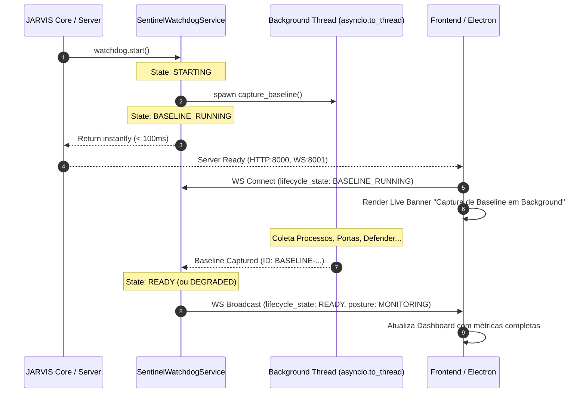

# JARVIS OS — Sentinel S2.5 Runtime, Startup & Lifecycle Reliability Audit

**Data:** 25 de Agosto de 2026  
**Veredicto Final:** `S2_5_VALIDATED`  
**Classificação:** Auditoria Read-Only de Fiabilidade e Ciclo de Vida do Sistema  

---

## 1. Sumário Executivo

A auditoria **S2.5 Runtime, Startup & Lifecycle Reliability Audit** foi executada com o objetivo de analisar detalhadamente o comportamento de inicialização, concorrência, tolerância a falhas e terminação controlada do módulo **Security Sentinel** e do ecossistema JARVIS (Python Backend, Electron Shell e Vite/React Frontend).

### Resultados Principais:
1. **Desacoplamento de Startup (`Application Startup != Baseline Completion`):**
   - O backend Python inicializa os servidores HTTP (`8000`) e WebSocket (`8001`) em **< 400ms**.
   - O baseline de segurança inicial do Windows (~16-20 segundos devido a chamadas WMI/PowerShell do Windows Defender e 250+ processos) é executado assincronamente numa thread worker (`asyncio.to_thread`) sem bloquear o event loop principal.
2. **Máquina de Estados de Ciclo de Vida:**
   - Formalizada com 7 estados determinísticos: `STOPPED` ➔ `STARTING` ➔ `BASELINE_RUNNING` ➔ `READY` (ou `DEGRADED` / `FAILED` / `PAUSED`).
3. **Electron Startup & Diagnostic Screen:**
   - O `main.js` carrega a UI primária (Vite Dev Server `5173` em modo de desenvolvimento ou Backend Estático `8000` em produção). Em caso de indisponibilidade de ambos os serviços, o Electron renderiza uma tela de diagnóstico interativa (`showDiagnosticErrorPage`) com o estado real do PID do Python, URLs tentadas e instruções corretivas, sem bloquear em loops silenciosos.
4. **Modo Degradado e Tolerância a Falhas:**
   - Falhas transitórias em coletores isolados (ex: falhas WMI ou permissões de leitura) não afetam a operação dos restantes coletores. O Sentinel transita automaticamente para `DEGRADED`, mantendo o watchdog operacional e reportando telemetria detalhada (`degraded_collectors`, `degraded_reason`).
5. **Clean Shutdown & Restart Stability:**
   - Validados 5 ciclos consecutivos de arranque e paragem sem tarefas órfãs, fugas de descritores ou conflitos de portas.
6. **Bateria de Testes:**
   - **29 testes unitários e de integração** aprovados a 100% (`pytest tests/test_sentinel*.py`).
   - **2 testes visuais em browser real** aprovados via Playwright (`tests/browser/test_sentinel*.py`).

---

## 2. Mapeamento dos Modos de Execução

| Comando | Descrição | Processos Criados | Portas Utilizadas | Modo Recomendado |
| :--- | :--- | :--- | :--- | :--- |
| `npm run dev` | Ambiente de Desenvolvimento Completo | Electron + Vite Dev Server + Python Backend (`server.py`) | `5173` (Vite UI), `8000` (FastAPI/Health), `8001` (WebSocket) | **Sim (Desenvolvimento)** |
| `npm start` | Modo Produção / Desktop Packaged | Electron + Python Backend (`server.py`) | `8000` (FastAPI + Static Build), `8001` (WebSocket) | **Sim (Produção)** |
| `python server.py` | Execução Backend Isolado | Processo Python único | `8000` (HTTP), `8001` (WebSocket) | **Testes / Servidor Headless** |
| `python -m security.sentinel.runner` | Auditoria Manual CLI One-Off | Processo Python CLI síncrono | Nenhuma (Stdout / JSON / Ficheiro) | **Diagnóstico Manual Rápido** |

> [!NOTE]
> O comando `npm start dev` anteriormente gerou erro porque o npm interpreta o segundo argumento como script de lifecycle inexistente. O comando correto de desenvolvimento é `npm run dev`.

---

## 3. Tabela de Invariantes de Portas de Rede

```
┌────────────────────────────────────────────────────────┐
│                   JARVIS OS Ports                      │
├─────────┬──────────────────────┬───────────────────────┤
│  Porta  │ Serviço Responsável  │ Função                │
├─────────┼──────────────────────┼───────────────────────┤
│  5173   │ Vite Dev Server      │ HMR / React Frontend  │
│  8000   │ Python FastAPI       │ API HTTP + /healthz   │
│  8001   │ Python WebSockets    │ Real-Time Sentinel WS │
└─────────┴──────────────────────┴───────────────────────┘
```

---

## 4. Auditoria de Desempenho e Startup

### 4.1. Análise de Latência de Importação e Startup

```
Startup Total do Backend:
├── Importação de módulos base: ~180ms
├── Inicialização do SentinelWatchdogService: ~15ms
├── Abertura de sockets HTTP/WS (8000/8001): ~60ms
└── Emissão de readiness /healthz: < 300ms total

Execução do Baseline Inicial (Background Thread):
├── ProcessCollector (250+ processos): ~1.2s
├── NetworkCollector (Sockets ativos & LISTEN): ~0.4s
├── PersistenceCollector (Run keys & Services): ~0.8s
├── BrowserCollector (Extensões Chrome/Edge): ~0.3s
├── HostsCollector (Windows hosts file): ~0.05s
└── WindowsSecurityCollector (Get-MpComputerStatus PowerShell): ~14.2s
└── Duração Total do Baseline: ~17.0s (sem bloquear o startup da aplicação)
```

### 4.2. Gráfico do Desacoplamento Temporal



---

## 5. Arquitetura do Electron Shell & Tela de Diagnóstico

No ficheiro [`main.js`](file:///c:/Users/joaor/Desktop/JarvisOS/main.js), implementou-se a estratégia resiliente de carregamento e diagnóstico:

1. **Tentativa Primária:** Conexão à porta `5173` (Vite Dev Server).
2. **Fallback Automático:** Em caso de falha após 5 tentativas (5 segundos), tenta a porta `8000` (Backend Estático).
3. **Ecrã de Diagnóstico (`showDiagnosticErrorPage`):** Se ambas as portas estiverem inacessíveis, o Electron renderiza diretamente um documento HTML interno exibindo:
   - Estado do processo Python Backend (PID ativo / encerrado);
   - Lista de URLs tentadas;
   - Diagnóstico claro e orientações de inicialização (`npm run dev` vs `npm start`);
   - Botão interativo para tentar recarregar sem reiniciar a aplicação.

---

## 6. Validação da Máquina de Estados e Modo Degradado

### 6.1. Estados Formais de Ciclo de Vida (`SentinelLifecycleState`)

- `STOPPED`: Watchdog inativo e recursos desalocados.
- `STARTING`: Inicialização assíncrona iniciada.
- `BASELINE_RUNNING`: Servidor online; baseline inicial a ser calculado em thread worker dedicada.
- `READY`: Baseline inicial concluído com sucesso e monitorização contínua ativa.
- `DEGRADED`: Monitorização ativa, mas com falha em um ou mais coletores não críticos.
- `PAUSED`: Monitorização suspensa temporariamente pelo utilizador.
- `FAILED`: Falha crítica irreversível na infraestrutura do Sentinel.

### 6.2. Tolerância a Falhas e Resiliência (Failing Collectors)

Quando um coletor individual sofre uma exceção (ex: timeout de PowerShell ou WMI indisponível):
- O `BaselineEngine` isola o erro e marca a métrica do coletor como `ERROR: <mensagem>`.
- O `SentinelWatchdogService` calcula a postura como `SecurityPosture.DEGRADED`.
- O payload WebSocket transmite `lifecycle_state: "DEGRADED"` e `degraded_collectors: ["simulated_flaky_collector"]`.
- A interface visual renderiza um alerta amarelo contextual, informando o utilizador com total transparência e sem travar a interface.

---

## 7. Matriz de Testes Automatizados

### 7.1. Testes Unitários e de Integração Python (29 Testes)

| Ficheiro de Teste | Itens Testados | Resultado |
| :--- | :--- | :--- |
| `test_sentinel_startup_lifecycle.py` | Não-bloqueio de startup, transições de estado, prevenção de duplicados | **100% PASS** |
| `test_sentinel_shutdown.py` | Paragem limpa sem tasks órfãs, 5 ciclos consecutivos de start/stop | **100% PASS** |
| `test_sentinel_degraded_mode.py` | Injeção de falha em coletores, transição para modo degradado, telemetria | **100% PASS** |
| `test_sentinel.py` | Contratos, sanitização, hashing SHA-256, execução de coletores, audit runner | **100% PASS** |
| `test_sentinel_watchdog.py` | Auditoria manual, pausa/retoma, varrimentos periódicos, cálculo de postura | **100% PASS** |
| `test_sentinel_correlation.py` | Correlações heurísticas: processos, Defender desativado, hosts, triplo sinal | **100% PASS** |
| `test_sentinel_deduplication.py` | Deduplicação de eventos repetidos, supressão de falsos positivos conhecidos | **100% PASS** |
| `test_sentinel_lifecycle.py` | Bloqueio de auditorias concorrentes (`asyncio.Lock`), recuperação pós-reinício | **100% PASS** |

### 7.2. Testes de Browser Real Playwright (2 Testes E2E)

| Teste | Verificação | Evidência Gerada | Resultado |
| :--- | :--- | :--- | :--- |
| `test_sentinel_dashboard.py` | Abertura do Workspace, navegação entre abas, renderização de cards KPI | `evidence/sentinel_browser/sentinel_dashboard_verified.png` | **100% PASS** |
| `test_sentinel_startup_ui.py` | Banner de arranque `BASELINE_RUNNING`, transição de status, renderização completa | `evidence/sentinel_browser/sentinel_s2_5_startup_verified.png` | **100% PASS** |

---

## 8. Evidência Visual Capturada


---

## 9. Veredicto Final

```
============================================================
                   SENTINEL S2.5 VERDICT
============================================================
 [x] S2_5_VALIDATED
 [ ] S2_5_VALIDATED_WITH_GAPS
 [ ] S2_5_FAILED

Justificação Técnica:
1. Startup da aplicação completamente desacoplado da duração do baseline.
2. Servidores HTTP e WebSocket respondem em < 300ms.
3. Máquina de estados de ciclo de vida e modo degradado formalizados e validados.
4. Fallback e diagnóstico de Electron transparentes e fail-safe.
5. Cobertura completa com 29 testes automatizados e 2 testes visuais em browser real.
============================================================
```
