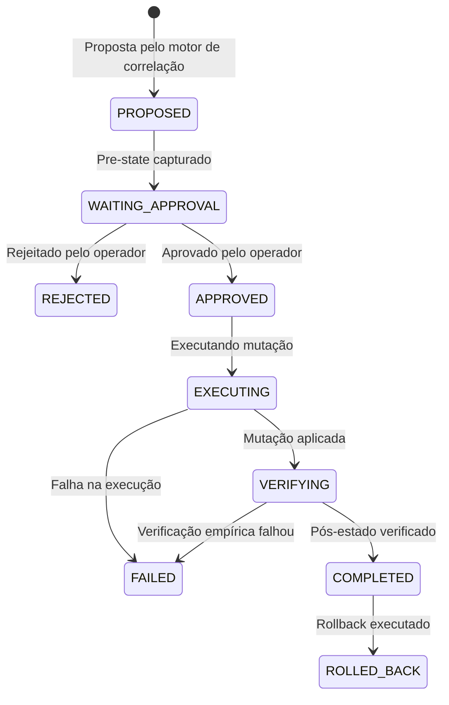

# JARVIS OS — Security Sentinel
# Fase S3: Modelo de Ação (Action Model)

## 1. Estrutura de Dados `SecurityResponseAction`
Cada proposta de resposta no Sentinel é representada pela classe `SecurityResponseAction` (`security/sentinel/contracts.py`):

```python
@dataclass
class SecurityResponseAction:
    action_id: str
    incident_id: str
    action_type: str
    target: str
    rationale: str
    evidence_ids: List[str] = field(default_factory=list)
    permission_level: str = PermissionLevel.LOW_RISK_MUTATION.value
    requested_by: str = "sentinel_correlation_engine"
    approval_required: bool = True
    approved_by: Optional[str] = None
    approval_session_id: Optional[str] = None
    approval_timestamp: Optional[float] = None
    pre_state: Dict[str, Any] = field(default_factory=dict)
    execution_result: Dict[str, Any] = field(default_factory=dict)
    post_state: Dict[str, Any] = field(default_factory=dict)
    verification_result: Dict[str, Any] = field(default_factory=dict)
    rollback_available: bool = False
    rollback_plan: str = ""
    rollback_result: Optional[Dict[str, Any]] = None
    status: str = ResponseActionStatus.PROPOSED.value
    created_at: float = field(default_factory=time.time)
    updated_at: float = field(default_factory=time.time)
    error_message: Optional[str] = None
    schema_version: int = 1
```

## 2. Ciclo de Vida da Ação (Status State Machine)



## 3. Imutabilidade e Auditoria
- **Histórico Persistido**: Todas as ações e transições são persistidas em `sentinel/response_history.json`.
- **Rastreabilidade**: Cada ação guarda hashes criptográficos de evidências associadas, carimbo de data/hora UTC e identidade do operador.
