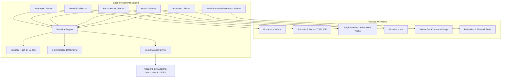

# JARVIS OS — Security Sentinel Architecture (Fase S1)

## 1. Visão Geral e Filosofia de Design
O **Security Sentinel** é o subsistema de defesa cibernética, telemetria contínua e auditoria de integridade do JARVIS OS. Ele foi concebido para monitorizar o sistema operativo Windows do utilizador segundo o modelo clássico de SOC defensivo:

```
OBSERVE → COLLECT → NORMALIZE → CORRELATE → SCORE → EXPLAIN → ALERT → APPROVE → RESPOND → VERIFY
```

> [!IMPORTANT]
> **Princípio da Fase S1 (Read-Only)**: O Sentinel nunca executa ações destrutivas, bloqueios de rede, mutações de registo ou término de processos na Fase S1. Toda a telemetria é recolhida de forma passiva, estruturada e verificável.

---

## 2. Diagrama de Componentes



---

## 3. Contratos de Dados e Integridade

### 3.1 `SecurityEvidence`
Cada observação recolhida é normalizada num registo de evidência imutável:
- `evidence_id`: Identificador único (`EV-<COLLECTOR>-<TIMESTAMP>-<HEX>`).
- `timestamp`: Epoch UNIX em milissegundos.
- `collector`: Nome do coletor que gerou a evidência.
- `host`: Nome da máquina local.
- `asset`: Recurso inspecionado (e.g. `process:1234`, `port:TCP:8080`, `file:hosts`).
- `observation`: Descrição em linguagem natural.
- `normalized_data`: Dicionário com schema tipado.
- `sha256`: Hash de integridade dos dados observados.
- `confidence`: Nível de confiança da observação (0.0 a 1.0).
- `privacy_classification`: Classificação de privacidade (`PUBLIC`, `INTERNAL`, `RESTRICTED`, `CONFIDENTIAL`).

### 3.2 `SystemBaseline` & `BaselineDiff`
Um snapshot do sistema consolida a totalidade dos 6 coletores, gerando um hash SHA-256 criptográfico canónico (`integrity_hash`). O motor `BaselineDiff` compara dois baselines de forma determinística, detetando:
- Novos processos ou processos terminados;
- Novas portas em escuta (*listening ports*) ou portas fechadas;
- Novas entradas de persistência no Registo/Startup/Tarefas;
- Modificações no ficheiro `hosts`;
- Instalação ou remoção de extensões de navegador;
- Alterações no estado da Firewall ou Windows Defender.

---

## 4. Coletores Especializados (Fase S1)

1. **`ProcessCollector`**: Inspeciona a tabela de processos via `psutil`, extraindo PID, PPID, nome, linha de comando (sanitizada de credenciais), utilizador, integridade, identificação de pastas temporárias (`%TEMP%`) e hash SHA-256 do executável.
2. **`NetworkCollector`**: Mapeia todas as conexões ativas e portas em escuta, correlacionando o socket com o PID e o nome do processo correspondente.
3. **`PersistenceCollector`**: Inspeciona chaves de registo `Run` e `RunOnce` (`HKCU` e `HKLM`), diretórios de arranque do utilizador e sistema, tarefas agendadas (`schtasks`) e serviços do Windows.
4. **`HostsCollector`**: Lê `C:\Windows\System32\drivers\etc\hosts`, calcula o hash SHA-256 e extrai mapeamentos customizados de IP para domínio.
5. **`BrowserCollector`**: Audita manifestos de extensões no Chrome e Edge, extraindo versões, origens e lista de permissões declaradas.
6. **`WindowsSecurityEventsCollector`**: Consulta o estado de proteção em tempo real do Windows Defender e perfis da Firewall.

---

## 5. Segurança do Próprio Sentinel
- **Mínimo Privilégio**: O Sentinel corre dentro do processo seguro do JARVIS OS sem exigir privilégios SYSTEM permanentemente.
- **Sanitização de Dados**: Linhas de comando com palavras-passe ou tokens são automaticamente mascaradas (`***REDACTED***`).
- **Zero Operações Mutativas em S1**: Não existem chamadas de escrita ao sistema operativo durante a auditoria.
