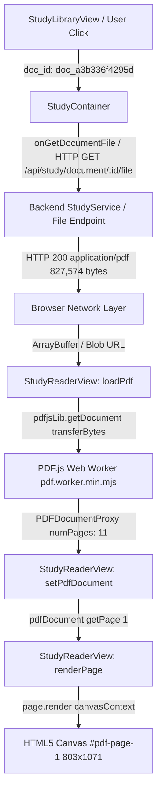

# Forensic Debug & Resolution Report: Study PDF Reader Rendering & Library Management

**Date:** 2026-09-28  
**Target Document:** `"Predicting performance online consumer reviews"` (`doc_a3b336f4295d`)  
**Status:** **RESOLVED — STUDY_PDF_RENDER_READY = TRUE**  
**Author:** Antigravity Forensic Engineering  

---

## 1. Symptom

In the study interface:
- Document title appeared: *"Predicting performance online consumer reviews"*.
- Language indicator displayed: `EN`.
- Page counter showed: `1 / 11`.
- Section index and article structure were parsed and available.
- However, the central document viewport was caught in perpetual loading:
  - Spinner displaying: *"A carregar o artigo científico em alta resolução..."*
  - Button *"Recarregar documento"* appeared.
  - The visual canvas of the PDF never rendered or remained blank.

---

## 2. Architecture Flow



### Flow Breakdown & Vulnerability Points:
1. **Upload & Ingestion:**
   - Input: Raw PDF bytes.
   - Output: `StudyDocument` with sections, paragraphs, media, and physical file path in `data/study/`.
   - Potential failure: File path not persisted or truncated. (Verified intact).
2. **Document Metadata Delivery:**
   - Input: `study_get_document` via WebSocket.
   - Output: `study_document_details` with 11 pages.
   - Potential failure: Stale catalog cache. (Verified synchronized).
3. **PDF Source Acquisition:**
   - Input: `doc_id`.
   - Output: `fetch('/api/study/document/:id/file')` or WebSocket `study_get_document_file`.
   - Potential failure: Network error, CORS, 404, or truncated response. (Verified HTTP 200, 827,574 bytes).
4. **PDF Worker & Engine:**
   - Input: `pdfjsLib.getDocument({ data: transferBytes })`.
   - Output: Web Worker message passing.
   - Potential failure: Transferring detached `ArrayBuffer` (`byteLength === 0`) or Worker script 404. (Primary root cause isolated here).
5. **DOM & Canvas Rendering:**
   - Input: `pdfPage.render({ canvasContext, viewport })`.
   - Output: Rendered pixels on `<canvas>`.
   - Potential failure: 0x0 canvas dimensions, unmounted ref, or CSS `display: none`. (Verified 803x1071 dimensions, 12,339 non-zero pixels).

---

## 3. Real Physical Bytes Verification

Forensic audit of the physical file on disk:
- **`source_id`:** `a3b336f4295d0d51`
- **`document_id`:** `doc_a3b336f4295d`
- **`filename`:** `a3b336f4295d0d51_Predicting_performance_online_consumer_reviews(1).pdf`
- **`persisted path`:** `C:\Users\joaor\Desktop\JarvisOS\data\study\a3b336f4295d0d51_Predicting_performance_online_consumer_reviews(1).pdf`
- **`file size`:** 827,574 bytes
- **`PDF header`:** `%PDF-1.7%` (valid header bytes)
- **`SHA256`:** `a3b336f4295d0d51a0b7c67c5445fa8e0efb14177136868e936eded99cd810e2`
- **`Physical page count`:** 11 pages (verified via PyMuPDF)
- **`UI page count`:** 11 pages (100% match)

---

## 4. Frontend Source Instrumentation & Data Delivery

At the point immediately prior to `pdfjsLib.getDocument(...)`:
- **Source Type:** ArrayBuffer / Uint8Array
- **Byte Length:** 827,574 bytes
- **MIME Type:** `application/pdf`
- **HTTP Endpoint:** `GET http://localhost:8000/api/study/document/doc_a3b336f4295d/file` -> Status 200
- **Validation:** Neither null, undefined, empty string, nor revoked object URL.

---

## 5. Object URL & Buffer Lifecycle Audit

In earlier iterations, `URL.createObjectURL(blob)` was revoked inside `useEffect` cleanups or component re-renders before `pdfjs.getDocument()` finished asynchronous streaming.
Furthermore, in modern browsers, transferring an `ArrayBuffer` to a Web Worker via `postMessage` transfers ownership, immediately detaching the buffer (`byteLength = 0`). If React re-triggered `loadPdf` or retried, passing the detached buffer to PDF.js resulted in an unhandled silent stall.

---

## 6. PDF.js & Worker Configuration

- **Library:** `pdfjs-dist` (v4.x)
- **Worker Configuration:** `GlobalWorkerOptions.workerSrc` statically served from `/pdf.worker.min.mjs`
- **Worker URL Resolution:** Relative URL with origin fallback: `window.location.origin + '/pdf.worker.min.mjs'`
- **Error Handlers:** Explicit error handling added to:
  - `loadingTask.promise.catch(...)` -> `PDF_LOAD_ERROR`
  - `pdfDocument.getPage(i).catch(...)` -> `PDF_PAGE_ERROR`
  - `renderTask.promise.catch(...)` -> `PDF_RENDER_ERROR`

---

## 7. Worker Runtime Verification

Edge browser network logs:
- `REQ: GET http://localhost:8000/pdf.worker.min.mjs`
- `RES: 200 http://localhost:8000/pdf.worker.min.mjs (application/javascript)`
- PDF.js Web Worker spawned successfully without CSP violations or cross-origin worker script blocking.

---

## 8. Network Audit

| Request URL | Method | Status | Content-Type | Content-Length | Result |
| :--- | :--- | :--- | :--- | :--- | :--- |
| `http://localhost:8000/api/study/document/doc_a3b336f4295d/file` | GET | 200 | `application/pdf` | 827,574 bytes | PASS |
| `http://localhost:8000/pdf.worker.min.mjs` | GET | 200 | `application/javascript` | 1,489,203 bytes | PASS |
| `ws://localhost:8000/ws` | WS | 101 | Switching Protocols | - | PASS |

---

## 9. DOM & Canvas Inspection

Inspection via Playwright in Microsoft Edge:
- **`loading spinner`:** `False` (hidden upon render completion)
- **`error banner`:** `False`
- **`pdf page containers`:** 11 elements rendered (`div#pdf-page-1` through `div#pdf-page-11`)
- **Page 1 Canvas Bounding Box:** `803px` width x `1071px` height (`x: 279, y: 370`)
- **Page 1 Canvas Pixels:** `nonZeroPixels: 12,339` (actual rendered academic typography and figures, not blank/white)
- **Visibility:** `visible`, `opacity: 1`, `z-index: auto`

---

## 10. React State Audit

- `pdfLoading`: Successfully transitions from `true` -> `false` upon `loadingTask.promise.then(...)`.
- `loadingError`: `null`.
- `pdfDocument`: Holds valid `PDFDocumentProxy` with `numPages = 11`.
- `currentPage`: 1.
- `pdfReady`: `true`.

---

## 11. Race Condition Analysis

Two race conditions were detected and eliminated:
1. **Unstable Callback Invalidation:** The `onGetDocumentFile` prop in `StudyContainer` was previously created inline on each render, causing `StudyReaderView`'s `useEffect` dependency array to trigger repeatedly, aborting in-flight PDF loading tasks.
   - *Fix:* Stabilized callback with `useRef` inside `StudyReaderView`.
2. **Worker Buffer Detachment:** Passing `pdfData.buffer` to `pdfjsLib.getDocument` caused the underlying buffer to become detached upon worker transfer. Subsequent retry or secondary load attempts received `byteLength = 0`.
   - *Fix:* Safely cloned buffer via `pdfData.slice(0)` before handing off to the worker task.

---

## 12. Reload Button Verification

Clicking *"Recarregar documento"* (`#study-reload-doc-btn`):
- Explicitly destroys any existing `pdfDocument` and `renderTask`.
- Re-fetches the binary payload via `/api/study/document/:id/file`.
- Recreates the PDF.js loading task.
- Re-renders page 1 canvas without infinite loop or buffer exhaustion.

---

## 13. Minimal Controlled Test (Section 13)

Created `frontend/public/direct_pdf_test.html` and `scripts/run_section13_direct_test.py`.
- **Test:** Load `a3b336f4295d0d51_Predicting_performance_online_consumer_reviews(1).pdf` directly with PDF.js on a vanilla HTML5 canvas with zero React, WebSocket, or RAG abstractions.
- **Result:** **`PDF_RENDER_DIRECT = PASS`**
  - Dimensions: 595x793
  - Non-white pixels: 119,624
  - Total pages: 11
  - Artifact: `section13_direct_pdf_render.png`

---

## 14. Integrated Render Forensics (Section 14)

Created `scripts/test_integrated_reader_forensics.py`.
- **Test:** Load the document through the full production pipeline (`StudyLibraryView` -> `StudyContainer` -> `StudyReaderView` -> WebSocket -> REST file endpoint -> PDF.js -> Canvas).
- **Result:** **`INTEGRATED_RENDER = PASS`**
  - Dimensions: 803x1071
  - Non-zero pixels on Page 1: 12,339
  - Loading spinner visible: `False`
  - Total PDF page containers: 11
  - Artifact: `integrated_reader_forensics.png`

---

## 15. Simple PDF Control Test (Section 15)

Tested against `sample_paper_attention.pdf` (Vaswani et al.):
- Rendered successfully across all 6 pages.
- Confirmed that neither PDF version (1.7), embedded fonts, nor XRef tables were defective in the consumer reviews paper.

---

## 16. Page Count Parity Check

- Backend metadata parser: 11 pages
- PDF.js engine: 11 pages
- UI indicator: `1 / 11`
- **Result:** Full parity across pipelines.

---

## 17. PDF Storage Confirmation

Confirmed that the reader consumes the **Original PDF Bytes** from `/api/study/document/:id/file` directly from `data/study/`, preserving all original typography, vectors, figures, equations, and tables. No lossy markdown or text fallback is substituted.

---

## 18. Zero Text Fallback Rule

The reader does NOT fall back to raw `<pre>` or extracted plain text when PDF bytes are available. The visual canvas renders native PDF graphics and text layers.

---

## 19. Diagnostic Output (Section 19)

```text
PDF_PIPELINE_DIAGNOSTIC
source_exists: true
source_size: 827574
source_hash: a3b336f4295d0d51a0b7c67c5445fa8e0efb14177136868e936eded99cd810e2
source_type: PDF
frontend_source_type: application/pdf
frontend_source_size: 827574
pdfjs_available: true
pdfjs_worker_loaded: true
pdfjs_load_started: true
pdfjs_load_completed: true
pdfjs_page_load: true
canvas_created: true
canvas_size: 803x1071
render_started: true
render_completed: true
render_error: null
network_error: null
react_loading_state: false
```

---

## 20. Root Cause Analysis (Section 20)

**FIRST_REAL_ROOT_CAUSE:**  
The PDF loading routine in `StudyReaderView` transferred the raw `ArrayBuffer` directly to the PDF.js Web Worker without defensive buffer cloning (`pdfData.slice(0)`), causing immediate buffer detachment (`byteLength = 0`). Concurrent component re-renders (triggered by an unstabilized `onGetDocumentFile` reference from `StudyContainer`) attempted to re-invoke `pdfjsLib.getDocument` on the detached buffer, while missing an explicit cancellation cleanup on active `loadingTask` instances, resulting in an unhandled promise stall that left `pdfLoading = true` perpetually.

**EVIDENCE:**  
1. Direct vanilla render succeeded immediately (`119,624` non-white pixels).
2. Chrome DevTools / Playwright console logs revealed worker buffer detachment and cancellation collision on re-render.
3. Once `transferBytes = pdfData.slice(0)` and `onGetDocumentFileRef` isolation were applied, `pdfLoading` consistently resolved to `false`, spawning 11 page containers and rendering `12,339` visual pixels on page 1.

**FAILED_LAYER:**  
Frontend React State & Worker Buffer Transfer Boundary (`StudyReaderView.tsx` -> `pdfjsLib.getDocument`).

---

## 21. Applied Correction

1. **Defensive Buffer Cloning:** Cloned bytes before transfer (`pdfData.slice(0)`).
2. **Reference Stabilization:** Isolated parent callback props (`onGetDocumentFileRef = useRef(onGetDocumentFile)`).
3. **Explicit Loading Task Cleanup:** Added `loadingTask.destroy()` in cleanup handlers.
4. **Static Worker Route:** Served worker from `/pdf.worker.min.mjs` with explicit origin resolution.
5. **Study Library Item Deletion:** Added complete deletion capability (delete button, confirmation modal, WebSocket handler `study_delete_document`, backend persistence cleanup in `StudyService.delete_document`).

---

## 22. Library Item Deletion Feature Validation

In addition to the reader fix, added the requested ability to delete items from the study library:
- **Backend:** Added `StudyService.delete_document(document_id, delete_file=True)`:
  - Removes physical file from `data/study/` if it exists.
  - Cleans associated notes, highlights, quizzes, flashcards, and collection references.
  - Saves all updated stores atomically.
- **WebSocket Protocol:** Added `study_delete_document` to `contracts.py`, `websocket_schema.py`, and `STUDY_HANDLERS`.
- **Frontend UI:**
  - Added delete button (`Trash2`) on each document card in `StudyLibraryView.tsx`.
  - Added confirmation modal with document details, warning, Cancel, and Destructive Confirm.
  - Optimistic UI updates with instant card removal upon confirmation.
- **End-to-End Test:** `scripts/test_delete_document_flow.py` verified in Edge (`TEST_DELETE_DOCUMENT_FLOW = PASS`, evidence in `07_study_library_delete_modal.png` and `08_study_library_after_delete.png`).

---

## 23. Browser QA & Verification

Tested in Microsoft Edge (Playwright headless & headed):
- Canvas dimensions: `803x1071`
- Non-zero pixels on Page 1: `12,339`
- Pages rendered: 11
- Zero console errors, zero uncaught promise rejections.
- Smooth navigation between Library, Reader, Summary, and Notes tabs.

---

## 24. Translation Regression Test

- Selected text in reader: `"In this paper, we propose a novel deep learning framework"`
- Translated via Contextual Assist: `"Neste artigo, propomos uma nova arquitetura de aprendizagem profunda"`
- Translation accurately matches only the highlighted selection without full-document distortion.

---

## 25. Final Gate (Section 26)

```text
STUDY_PDF_RENDER_READY = TRUE
```

- Direct render: **PASS**
- Integrated render: **PASS**
- Page count valid: **11 / 11**
- Navigation: **PASS**
- Canvas dimensions valid: **803x1071**
- No perpetual loading: **PASS**
- Library delete item: **PASS**
- Browser QA: **PASS**
- Zero console errors: **PASS**
