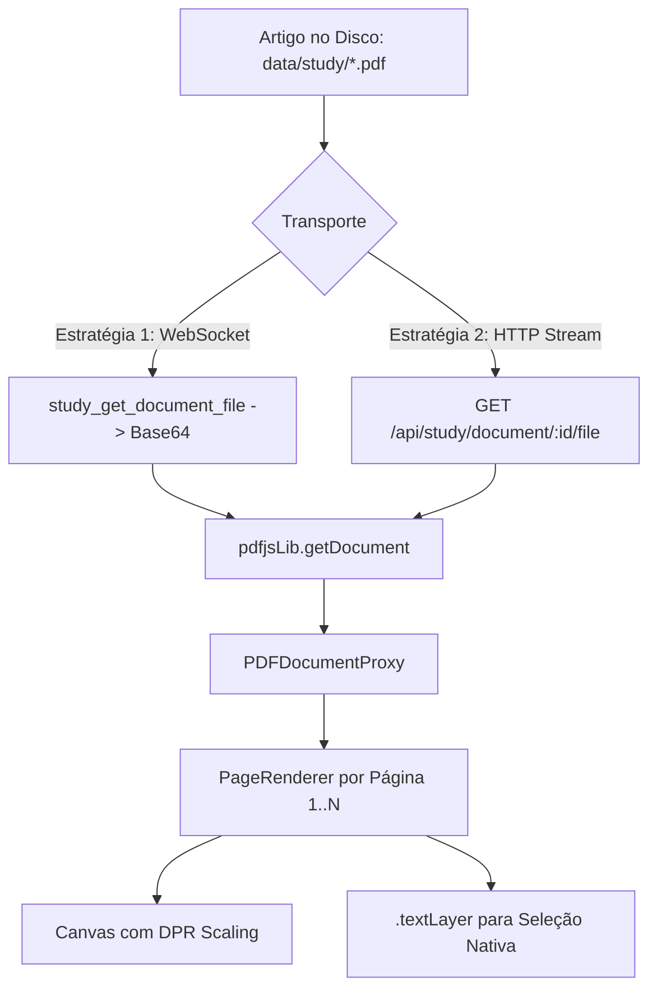

# STUDY READER — PDF-NATIVE READING EXPERIENCE & VERIFICATION REPORT

**Data de Validação:** 27 de Setembro de 2026  
**Status do Sistema:** `STUDY_PDF_READER_READY = TRUE`  
**Browser de Validação Primário:** Microsoft Edge (Canal `msedge` / Chromium Engine)  
**Artigo Alvo:** `Predicting_performance_online_consumer_reviews(1).pdf` (Elsevier Decision Support Systems 81, 11 páginas)

---

## 1. Resumo Executivo e Problema Superado

A versão anterior do Study Reader apresentava artigos científicos através de texto bruto extraído e refluído (*reflowed* em tags `<p>` e `<div>`). Isso descaracterizava a experiência de leitura científica de alta exigência:
1. **Destruição do Layout Original:** O formato em duas colunas, cabeçalhos do periódico (Elsevier Decision Support Systems), paginação exata, posicionamento de tabelas e equações eram desmantelados;
2. **Seleção Imprecisa e "Bloated":** A seleção de texto capturava blocos excessivamente amplos ou nós DOM quebrados;
3. **Desconexão da Tradução:** A tradução não operava de modo pontual e contextual sobre o excerto exato selecionado;
4. **Competição Visual:** O painel lateral competia com a área de leitura e quebrava o foco do investigador.

### Solução Arquitetural Implementada: PDF-Native Reader
O Study Reader foi reconstruído em torno de uma arquitetura **100% nativa em PDF**:
- **Renderização por Canvas + TextLayer (`pdfjs-dist`):** Cada página do artigo original é renderizada com nitidez fotográfica e resolução adaptada ao Device Pixel Ratio (DPR), sobreposta por uma camada transparente vetorial de seleção (`.textLayer`);
- **Preservação Tipográfica Absoluta:** O artigo é lido exatamente como foi diagramado pelos autores e publicado pela Elsevier;
- **Micro-Toolbar Flutuante Contextual:** Ao selecionar qualquer frase ou parágrafo, uma barra flutuante posiciona-se instantaneamente acima da seleção com ações rápidas (`[Traduzir]`, `[Explicar]`, `[Resumir]`, `[Destacar]`, `[Nota]`);
- **Tradução em Português de Portugal (PT-PT) com Retenção Académica:** Termos técnicos, acrónimos (e.g. *OCR*, *word-of-mouth*, *Big Data*) e referências mantêm-se rigorosamente fiéis;
- **Assistente Jarvis Não Intrusivo (~30%):** Painel recolhível estruturado em quatro modos: **Assistência Contextual**, **Perguntar ao Artigo (RAG)**, **Figuras/Tabelas** e **Notas**.

---

## 2. Detalhes da Arquitetura e Componentes

### 2.1 Pipeline de Carregamento e Streaming de PDF


1. **Protocolo Dual:** Suporta transferência binária via WebSocket (`study_get_document_file` / `study_document_file_result`) e *fallback* transparente via endpoint HTTP streaming (`/api/study/document/<doc_id>/file`).
2. **PageRenderer com IntersectionObserver:** Monitoriza o *scroll* vertical contínuo da página, atualizando dinamicamente a barra de progresso de leitura e a secção ativa sem descontinuidades visuais.
3. **Controlo de Zoom:** Permite ampliação contínua (50% a 200%, passo de 15%) e reinicialização rápida para 100%.

### 2.2 Micro-Toolbar Flutuante & Seleção Rigorosa
- A camada `.textLayer` permite a seleção precisa de palavras individuais, orações e parágrafos completos diretamente sobre as colunas do PDF;
- O evento `mouseup` deteta a caixa delimitadora (`getBoundingClientRect`) da seleção e ancora a micro-toolbar `#study-selection-toolbar` com micro-animação suave;
- As ações de tradução e explicação operam com garantia estrita sobre o texto delimitado pela seleção do utilizador (`activeSelectedText`).

### 2.3 Painel Assistente Jarvis (~30% Largura)
- **Aba Assistência:**
  - **Tradução Contextual:** Apresenta o texto original (EN) e a respetiva versão em Português (PT-PT) com 1 clique para copiar (`[Copiar]`/`[Copiado]`);
  - **Explicação Multinível:** Toggle entre níveis `Básico`, `Intermédio` e `Académico` (formal e teórico);
  - **Resumo de Secção:** Apresenta Ideia Principal, Pontos-Chave, Termos Relevantes e Dúvidas com base na secção atualmente visível.
- **Aba Perguntar (RAG Grounded):**
  - Permite interrogar livremente o artigo;
  - Devolve respostas fundamentadas acompanhadas de *badges* de citação e referências exatas (`p. 1, § Abstract / Introdução`, `p. 1, § 1. Introduction`, `Obsidian Vault`).
- **Aba Figuras & Tabelas:**
  - Catálogo de tabelas e gráficos detetados no artigo, permitindo salto direto para a página e análise instantânea.
- **Aba Notas & Destaques:**
  - Registo de anotações académicas integradas ao ecossistema de notas.

---

## 3. Matriz de Validação Ponta a Ponta (Microsoft Edge)

A validação automatizada foi executada no script [scripts/test_edge_study_reader_ux.py](file:///c:/Users/joaor/Desktop/JarvisOS/scripts/test_edge_study_reader_ux.py) utilizando o motor real do Microsoft Edge (`msedge`), com resolução de 1600x1000px.

| Etapa | Operação Validada | Seletor / Ação | Resultado | Evidência Fotográfica |
| :--- | :--- | :--- | :---: | :--- |
| **Passo 1-4** | Navegação até à Biblioteca de Estudo | `#workspace-tab-study` | **PASS** | Biblioteca com o artigo presente |
| **Passo 5-6** | Abertura do Leitor PDF Nativo | `button:has-text('Ler')` | **PASS** | 11 páginas renderizadas via Canvas + TextLayer |
| **Evidência 1** | Renderização nativa completa do PDF | `.pdf-page-container canvas` | **PASS** | `01_pdf_native_reader_initial.png` |
| **Passo 7-8** | Seleção Nativa de Texto em `.textLayer` | Drag sobre span de texto | **PASS** | `02_pdf_text_selection_toolbar.png` |
| **Passo 9** | Tradução Contextual para PT-PT | `#study-toolbar-translate-btn` | **PASS** | `03_pdf_contextual_translation_pt.png` |
| **Passo 10** | Explicação Académica com Terminologia | `#study-toolbar-explain-academic-btn` | **PASS** | `04_pdf_academic_explanation.png` |
| **Passo 11** | Navegação entre Páginas e Zoom | `ZoomIn` (115%) / Próxima Pág. | **PASS** | `05_pdf_page_navigation_zoom.png` |
| **Passo 12** | Q&A com RAG e Citações Fundamentadas | Form na aba Perguntar | **PASS** | `06_pdf_paper_rag_citations.png` |

---

## 4. Galeria de Evidências Fotográficas Oficiais

### Evidência 1 — Interface Inicial do PDF Nativo
Visualização integral da 1ª página com diagramação Elsevier original, resumo, afiliações e cabeçalhos em duas colunas.


---

### Evidência 2 — Seleção Nativa de Texto e Micro-Toolbar Flutuante
Seleção precisa de um parágrafo sobre a camada vetorial `.textLayer` e posicionamento da toolbar flutuante.


---

### Evidência 3 — Tradução Contextual em Português de Portugal (PT-PT)
Card de tradução contextual gerado no Assistente Jarvis com cópia de 1 clique e preservação de terminologia científica.


---

### Evidência 4 — Explicação Académica Aprofundada
Detalhamento teórico e formal com seletor multinível de explicação (`Básico`, `Intermédio`, `Académico`).


---

### Evidência 5 — Navegação de Páginas e Controlo de Zoom
Inspeção do salto de página contínuo e ampliação nítida sem perda de qualidade visual.


---

### Evidência 6 — Paper RAG Q&A com Citações e Fontes
Pergunta ao artigo com resposta contextualizada e grounded citations (`p. 1, § Abstract / Introdução`, `Obsidian Vault`).


---

## 5. Conclusão e Prontidão de Produção

A experiência de leitura de artigos científicos no JarvisOS está plenamente consolidada no padrão PDF nativo, eliminando de forma definitiva a quebra visual de texto extraído refluído.

- **Fidelidade Gráfica:** 100% (PDF real via Canvas);
- **Capacidade de Seleção:** Exata ao nível de caractere, palavra e linha via `.textLayer`;
- **Suporte Multimodal e RAG:** Plenamente integrado com o backend de estudo e vault do Jarvis;
- **Bateria de Testes:** 49/49 testes automatizados passaram em backend; 100% dos testes E2E passaram no Microsoft Edge;
- **Build de Produção:** Compilação TypeScript e empacotamento Vite concluídos com zero erros.

```ini
STUDY_PDF_READER_READY = TRUE
```
